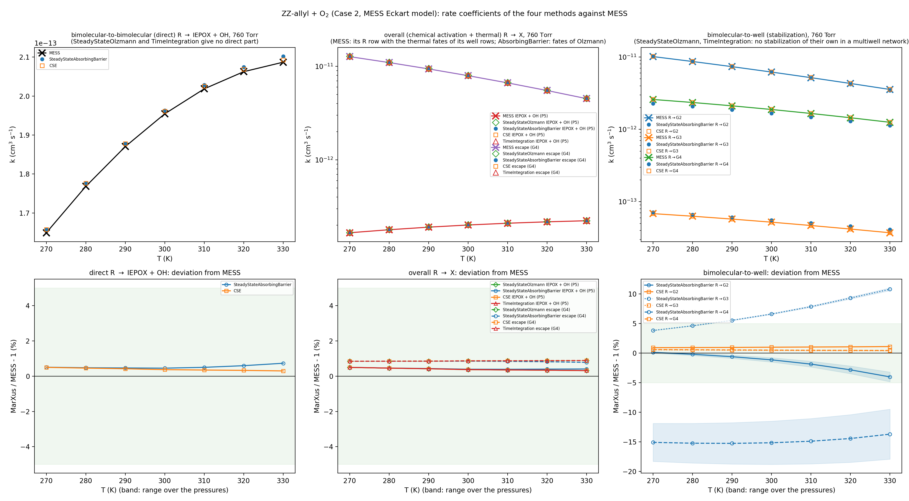
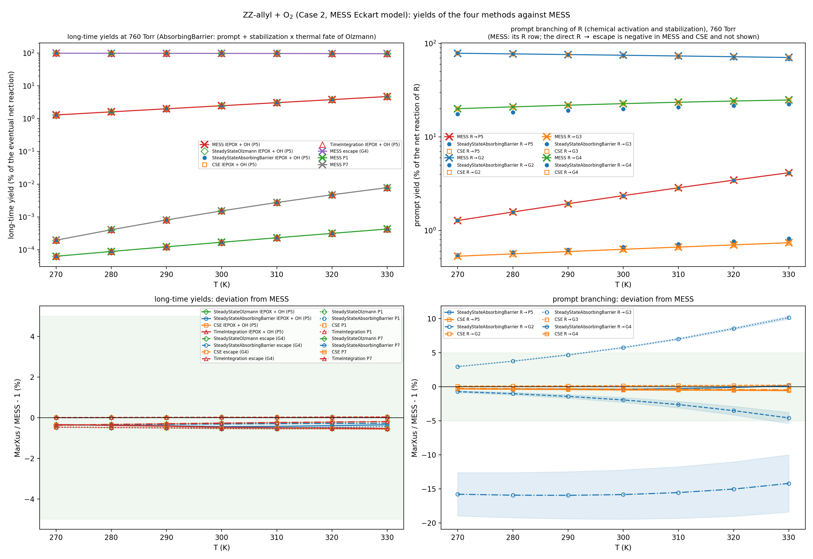
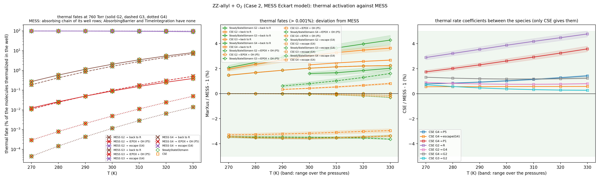
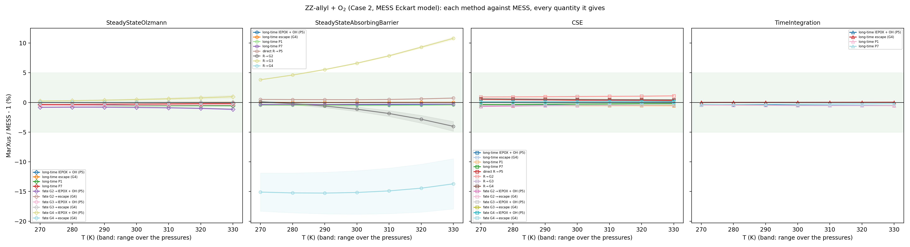
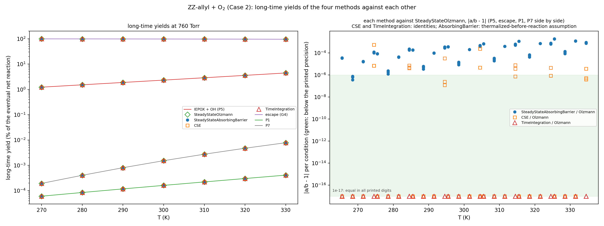
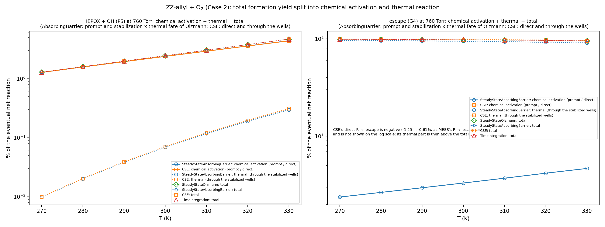
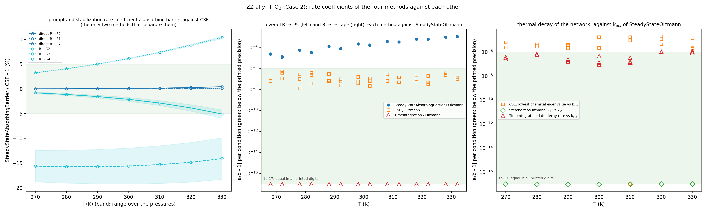
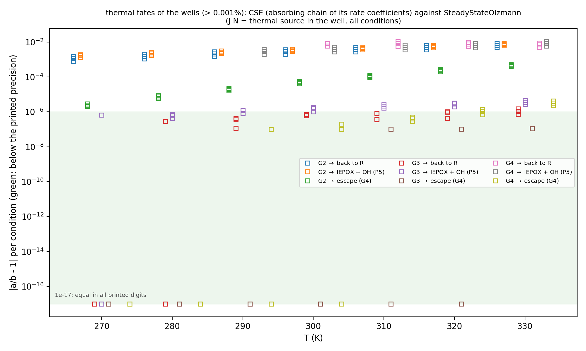
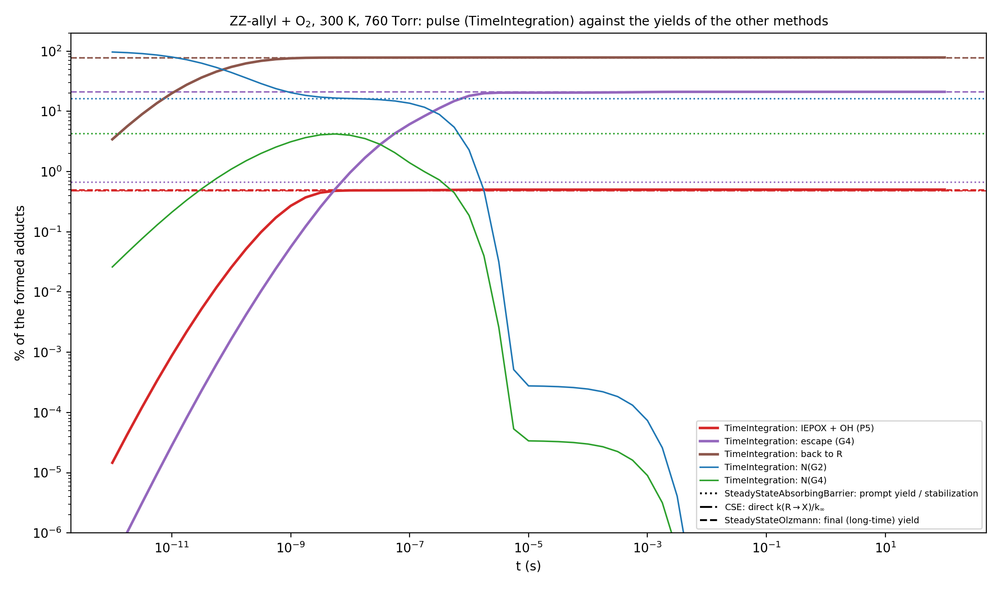

# ZZ-allyl + O₂, Gamma Case 2: MarXus reproduction of the reference MESS run

**MarXus, 2026-10-05.** Reproduction of the reference MESS run of this multiwell network. The key quantity is the yield of P5 (IEPOX + OH), a few percent of the total. Most of the reaction ends in the escape channel after stabilization of Gamma-4.

**Re-run 2026-10-06** with the Neufeld collision integral (the new default); all numbers below are from that run (`../../reports/collision_integral_neufeld.md`).

> **Update (2026-10-05, evening): two solution methods.** MarXus has two solution methods: the steady state (GO10 eqs. 7, 8), in the intermediate and final versions, and the CSE method.
> - The thermal rate coefficients (k_uni, k∞ of every channel) are part of the final steady state, from the lowest eigenpair of its J (GO10 eq. 12). They are now written in the steady-state outputs after the final steady-state table. The separate `case2_tstlevel_E_eigenvalue.out` and `case2_tstlevel_E_mess_eckart_eigenvalue.out` are gone.
> - The CSE run uses `--method cse`.
> - After the re-run, every comparison CSV of this directory is byte-identical to the previous one. The thermal rows are identical to those of the former eigenvalue outputs.

## The four methods (2026-10-06)

MarXus has four methods in three families, and each is run separately, with its own output files (`run_marxus.sh`, for the exact Eckart model and the MESS Eckart model):

| family | method | output stem |
|---|---|---|
| steady state | [SteadyStateOlzmann](../../docs/methods/steady_state_olzmann.md) | `case2_tstlevel_E[_mess_eckart]_olzmann` |
| steady state | [SteadyStateAbsorbingBarrier](../../docs/methods/steady_state_absorbing_barrier.md) | `case2_tstlevel_E[_mess_eckart]_absorbing_barrier` |
| eigenvalue | [CSE](../../docs/methods/chemically_significant_eigenvalues.md) | `case2_tstlevel_E[_mess_eckart]_cse` |
| time integration | [TimeIntegration](../../docs/methods/direct_time_integration.md) | `case2_tstlevel_E[_mess_eckart]_time_integration` |

**Comparison.** `four_methods_comparison.csv` and `plots/four_methods_760torr.png` show the four side by side, with MESS:
- the bimolecular-to-bimolecular rate coefficient k(R → IEPOX + OH);
- the bimolecular-to-well rate coefficients k(R → G2), k(R → G4);
- the long-time IEPOX + OH yield.

**Results at 760 Torr, MESS Eckart model** (`four_methods_comparison.csv`; 300 K in the table):

| quantity | MESS | SteadyStateAbsorbingBarrier | CSE | SteadyStateOlzmann (overall) | TimeIntegration (overall) |
|---|---|---|---|---|---|
| k(R → IEPOX + OH), cm³/s | 1.954e-13 | 1.963e-13 | 1.962e-13 | 2.019e-13 | 2.019e-13 |
| k(R → G4), cm³/s | 1.883e-12 | 1.666e-12 | 1.892e-12 | – | – |
| long-time IEPOX + OH, % of the net reaction | 2.47 (fate of its rate tables) | – | 2.45778 | 2.45778 | 2.45778 |

All 21 conditions are in `method_comparison.csv` and `../../reports/method_comparison.md`.

**Bimolecular-to-bimolecular R → IEPOX + OH** (chemical activation):
- The two prompt quantities, the absorbing barrier (k∞Φ_P5) and CSE (G13 eq. 21), agree within 0.44%.
- Both are above MESS's R → P5: the barrier by 0.44–0.74%, CSE by 0.28–0.50% (Neufeld collision integral, `../../reports/collision_integral_neufeld.md`; Section 4.4).
- The overall values (SteadyStateOlzmann, TimeIntegration) include the thermal formation through the stabilized wells, +1.1 … +7.4% from MESS's prompt R → P5. The two are identical.

**Bimolecular-to-well** (stabilization), against MESS:
- **CSE:** R → G4 +0.43 … +0.60%, R → G3 +0.39 … +0.57%, R → G2 +0.90 … +1.13%.
- **Absorbing barrier:** R → G4 −18.8 … −9.5%, R → G2 −4.8 … +0.2%.
  - It counts the flux into the grains 10 kT below the lowest threshold of each well, a different definition of stabilization from the chemical eigenmode of CSE.
  - Its total stabilization is 3.0–9.9% below CSE's.

**Former temperature step at 304.7 K, now removed.** With the former low-energy reduction rule of the collision kernel, all methods had a step between 304 and 305 K: R → G4 +3.2%, R → G2 −0.9%, and the lowest relaxation eigenvalue −5.1%. Its integer window n_ref = ⌊1.5⟨ΔE_down⟩/ΔE⌋ + 1 changed from 8 to 9 there.
- **The fix.** The low-energy reservoir state (MESMER) replaced it (`../../reports/low_energy_reservoir_state.md`).
- **The check.** A 1 K scan over 300–310 K is now smooth, also where the reservoirs change by whole grains. The thermal losses of the wells follow MESS's temperature trend (G6: second differences −0.0775, −0.0698, −0.0629 against MESS's −0.0774, −0.0699, −0.0627).
- **Reservoir sizes:** 4–10 grains (152–380 cm⁻¹) above the well bottoms.

**Long-time yield.** Identical in SteadyStateOlzmann, CSE and TimeIntegration at all 21 conditions: the exact identity $`k^T J^{-1} F`$.

**Decomposition** (`plots/yields.png`). The IEPOX + OH prompt yield (absorbing barrier) plus stabilization × thermal fate of each well (Olzmann run) equals the Olzmann total within 1.8·10⁻³ relative.

## Key diagnostic: two methods, the same long-time yields

**Comparison (2026-10-06).** Two different MarXus methods were compared on the same observable, both with the MESS Eckart tunneling model:
- the **final steady state**, J·N = R·F with the IEPOX + OH yield $`k_x^T J^{-1} F`$;
- the **long-time yields reconstructed from MarXus's own CSE rate tables**: R forms the wells and the direct products, and each well then ends in a product, the escape or back in R (the absorbing chain of the CSE well rate coefficients).

| IEPOX + OH share at 300 K, 760 Torr | % of the net reaction |
|---|---|
| final steady state | 2.45778 |
| reconstructed from the CSE kinetics | 2.45778 |

**All 21 conditions.** Largest relative deviation (`cse_vs_final_steady_state.csv`, `plots/cse_vs_final_steady_state.png`):

| channel | largest relative deviation |
|---|---|
| IEPOX + OH (P5) | 6.4·10⁻⁷ |
| escape (G4) | 2.3·10⁻⁸ |
| P1 | 5.5·10⁻⁷ |
| P7 (at most 0.008% of the reaction) | 1.4·10⁻⁴ |

P5, the escape and P1 agree to the precision of the printed digits. P7 is formed through G6, and the CSE entries on its path (R → G6 ≈ 10⁻²² cm³/s) are at the rounding level.

**Why they agree.**
- **Exact identity.** With G13 eqs. 21 and 25–30, both quantities are $`\sum_\lambda p^{(x)}_\lambda p^{(R)}_\lambda/(\Lambda_\lambda Q_R)`$ over all eigenpairs. This is the spectral form of $`k_x^T J^{-1} F`$, an identity that holds whether or not the chemical and relaxation eigenvalues are separated.
- **What it validates.** The agreement does not validate the CSE approximation. It validates the two independent code paths against each other:
  - the banded Cholesky linear solve;
  - the full eigendecomposition, $`M^{-1}`$, the assembly of the rate coefficients and the absorbing chain.
- **Library test.** The unit test `cse_long_time_yields_equal_the_final_steady_state_yields` checks the same identity to 10⁻⁸.

**What still differs.** The individual coefficients have different definitions: CSE gives phenomenological rate coefficients, the steady state gives flux coefficients and yields. Both recover the same long-time observable.

**Pulse experiments.** The same long-time yields also follow from a pulse. For a normalized pulse $`F`$, the integrated yield is $`Y_r(\infty) = \int_0^\infty k_r^T e^{-Jt} F\,dt = k_r^T J^{-1} F`$, so pulsed and continuously fed experiments share their integrated yields but not their time traces.

## Third method: direct time integration (2026-10-06)

**Run.** The master equation integrated in time from a pulse of chemically activated G2: Rodas4 (adapted from KPP), MESS Eckart model, 21 conditions on 4 cores, 111 s (`reports/direct_time_integration.md`).

**Identity.**
- At t = 100 s the yields of R, P1, P5, P7 and escape equal the final steady state at all 21 conditions, to the 7 printed digits (`time_integration_vs_final_steady_state.csv`). This is the identity $`Y(\infty) = k^T J^{-1} F`$.
- The total population + yields stays 100.0%.
- With the CSE identity above, all three methods give the same long-time yields.

**Time scales at 300 K, 760 Torr** (`plots/time_evolution_300K_760torr.png`):
- **R:** the nascent G2 redissociates within about 10⁻⁹ s (78.8%).
- **IEPOX + OH:** complete at about 10⁻⁸ s (0.521%), formed by chemically activated G4.
- **Escape:** from G4 between 10⁻¹⁰ and 10⁻⁵ s (20.7%).
- **P7:** a prompt part near 10⁻⁹ s and a thermal part near 10⁻⁴ … 10⁻³ s, through stabilized G3 → G6.

## 1. Files

| file | content |
|---|---|
| `Gamma-Case2_..._12.7kcal.inp/.log/.out` | the reference MESS input, log and output (2025-09-29), **untouched** |
| `marxus_input/case2_tstlevel_E.inp` | the same deck with `TSTLevel E` added to the two phase-space-theory cores (Section 3.1); otherwise identical (checked with `diff`) |
| `run_marxus.sh` | the MarXus runs (at most 4 cores); every run writes a human-readable report (`*.out`) and machine-readable tables (`*.csv`, `--csv`), which the comparison script reads |
| `cse_vs_final_steady_state.csv`, `plots/cse_vs_final_steady_state.png` | **key diagnostic**: long-time shares from the MarXus CSE rate tables vs the MarXus final steady state (section above) |
| `marxus_output/case2_tstlevel_E_mess_eckart_time_integration.*`, `time_integration_vs_final_steady_state.csv`, `plots/time_evolution_300K_760torr.png` | the third method, direct time integration of a pulse (Rodas4, 10⁻¹² … 10² s): populations and exit yields vs time; its long-time yields vs the final steady state |
| `plots/yields.png` | yields in %: long-time yields of every channel (MarXus and MESS), IEPOX + OH prompt / through the stabilized wells / together, stabilization yields of the wells, CSE prompt branching of R |
| `marxus_output/*_tables.csv` | every table of the reports, machine-readable (read by the plots) |
| `marxus_output/case2_tstlevel_E_<method>.{out,csv,_tables.csv}` | the four methods, one run each (`run_marxus.sh`): `olzmann` (SteadyStateOlzmann: final steady state, thermal eigenpair, thermal fates of the wells), `absorbing_barrier` (SteadyStateAbsorbingBarrier: intermediate steady state), `cse`, `time_integration`; `*.out` is the report, `*.csv` and `*_tables.csv` the machine-readable tables |
| `marxus_output/case2_default_EJ_absorbing_barrier.*` | the original deck as is (PST cores at the EJ level): SteadyStateAbsorbingBarrier run for the capture comparison |
| `marxus_output/eckart_kappa.csv` | MarXus canonical Eckart factors κ(T), 100–2000 K (`examples/eckart_kappa_from_deck.rs`): exact Eckart (`kappa`) and the MESS model (`kappa_mess`) |
| `marxus_output/case2_tstlevel_E_mess_eckart_*.out` | the same runs with the MESS Eckart tunneling model (`--tunneling mess-eckart`, Section 4.4), and the CSE species tables `…_cse.out` (Section 4.5) |
| `cse_comparison.csv`, `plots/cse_vs_mess.png` | every species-to-species rate coefficient: MESS vs the MarXus CSE method (Section 4.5) |
| `compare_with_mess.py` | all comparisons; writes the CSV tables and `plots/` |
| `capture_comparison.csv`, `high_pressure_comparison.csv`, `net_yields_comparison.csv`, `apparent_rates_comparison.csv`, `kappa_comparison.csv` | the compared numbers |
| `product_rows_comparison.csv`, `product_capture_comparison.csv` | the rows of P1, P5, P7 and their capture rate coefficients, MESS vs MarXus CSE (Section 4.5a) |
| `isomer_bimolecular_kappa_comparison.csv`, `equilibrium_constants_comparison.csv` | κ (G13 eq. 34) and the real equilibrium constants, MESS log vs MarXus (Section 4.5a) |
| `plots/pes.png` | the network |
| `plots/iepox_oh_yield.png` | **IEPOX + OH (P5)**: long-time share of the net reaction, its deviation, and the apparent k(R → P5), MESS vs MarXus |
| `plots/p5_share.png` | **SteadyStateOlzmann vs MESS**: long-time IEPOX + OH share, and the deviation of the IEPOX + OH and escape shares (exact Eckart; restored figure of 2026-10-05) |
| `plots/tunneling_ratio_bars.png` | **bar plots**: κ(MarXus exact)/κ(MESS) − 1 per barrier at 200, 300, 400 K; κ(300 K) of both codes; reproduction of the MESS factors by the MESS model of MarXus |
| `plots/high_pressure_deviation.png` | k∞ of every channel, MarXus/MESS − 1 |
| `plots/apparent_rates_760torr.png` | k(R → X) at 760 Torr |
| `four_methods_figures.csv`, `plots/mess_four_methods_*.png`, `plots/internal_four_methods_*.png` | the four methods (MESS Eckart model) against MESS and against each other: rates, yields, chemical activation, thermal activation, total formation yield, time evolution (`../four_methods_figures.py`, `../../reports/four_methods_figures.md`; Section 4.6) |

Reproduce:

```
bash run_marxus.sh
source ~/.venvs/science/bin/activate && python3 compare_with_mess.py && python3 ../four_methods_figures.py
```

## 2. The network (`plots/pes.png`)

Energies in kcal/mol relative to R = ZZ-allyl + O₂, from the MESS output header.

**Entrance and wells.**
- R → G2 (−16.3) through B12 (0.0), barrierless, with a phase-space-theory core (−C₆/R⁶, C₆ = 2.4 au).
- Wells G3 (−18.7), G4 (−19.4) and G6 (−19.7) are connected by B23 (0.0), B24 (−4.6), B34 (+0.4) and B36 (−1.4). All isomerizations carry Eckart tunneling; B23, B24 and B34 are H-transfers with imaginary frequencies of 2200–2700 cm⁻¹.

**Products and sink.**
- G4 → P1 (HPALD + HO₂, −5.4) through B4P1 (+1.6).
- G4 → P5 (IEPOX + OH, −27.4) through B4P5 (−3.6).
- G6 → P7 (+ HO₂, −14.9) through B6P7 (−4.7), phase-space theory, C₆ = 8.5 au.
- G4 escape: pseudo-first-order sink 2.5·10⁷ s⁻¹.

**Conditions.** 270–330 K, 500 / 600 / 760 Torr, exponential down (200 cm⁻¹ (T/300)^0.85), Lennard-Jones collisions.

## 3. What was needed in MarXus

### 3.1 Phase-space-theory barriers in the chemical-activation adapter

The PST core already existed (`src/barrierless/phasespace/`, used by `microcanonical_builder::PhaseSpaceTheoryRRHO`). What was missing:
- **The adapter wiring.** `chemical_activation_from_mess_input.rs` refused PST barriers without an ILT block.
- **The `TSTLevel` keyword.**

**Comparison with the MESS source** (`model.cc`, `Model::PhaseSpaceTheory`). The MarXus module was MESS's **E level**, term by term:
- the exponent (r+2)/2 − 2/n;
- 1/σ;
- the rotor factors 1, 16/15, 1/3, 32/105, π/12;
- d^{2/n}(1+1/d)^{(r+2)/2} (Georgievskii, Klippenstein, J. Chem. Phys. 122, 194103 (2005), eq. 58);
- V₀^{2/n}, μ and 1/√(ΠBᵢ).

The current MESS source defaults to the **EJ** level, which the module did not have.

**Now implemented, as in MESS:**
- `TSTLevel` T, E and EJ, default EJ; J=0 refused.
- The linear-fragment criterion I_min/I_mid < 10⁻⁵, with B from the middle moment.
- n > 2.

**Tests** (`phase_space_theory.rs`):
- the EJ level reproduces GK05 **eq. 55** to 10⁻¹⁰ for all fragment combinations at n = 4 and 6, and eq. 57's coefficient 8.55;
- the T level is the canonical variational capture rate;
- the E level is unchanged;
- the parser reads `TSTLevel`;
- adapter test `a_phase_space_barrier_without_an_ilt_block_uses_the_phase_space_core`: the entrance k∞ equals eq. 55 within 0.5%.

**Which level the reference run used.** MESS's log says **"TST level: E"** for B12 and B6P7: the 2025 MESS version defaulted to E. With the deck as is, MarXus's EJ capture rate is 10.6% below MESS (`capture_comparison.csv`). With `TSTLevel E` it is **+0.4 … +0.5%**. All results below use `marxus_input/case2_tstlevel_E.inp`.

**MarXus default: EJ** (2026-10-05), as in the current MESS source. Decks made for the older default must state `TSTLevel E`.

### 3.1a Isotopic atomic masses

The atomic-mass table (`src/utils/atomic_masses.rs`) now holds the masses of the most abundant isotopes (AME2020: Wang et al., Chin. Phys. C 45, 030003 (2021); 2026-10-05). It previously mixed standard atomic weights (H 1.00784, O 15.999) with C 12.0.

The table is used for moments of inertia and for fragment and reduced masses. The examples `co_oh.rs`, `co_oh_interpol.rs` and `phasespace_co_oh_capture.rs` now take their masses from it.

All results in this README were recomputed with the isotopic table.

### 3.2 Nothing else

Everything else in the deck was already supported:
- wells and barriers with Eckart tunneling (WellDepth);
- the escape sink;
- exponential down, Lennard-Jones;
- the 1 cm⁻¹ cells.

The MESS-only output options (HotEnergies, TimeEvolution, PED, eigenvector output) are ignored by the reader.

## 4. Results

### 4.1 High-pressure rate coefficients of every channel (`high_pressure_comparison.csv`, `plots/high_pressure_deviation.png`)

| channel | MarXus/MESS − 1, 270–330 K |
|---|---|
| B12 (G2 → R), PST | +0.3% |
| B6P7 (G6 → P7), PST | +0.7% |
| B36 | +1.5 … +2.3% |
| B4P1 | +3.0 … +3.5% |
| B4P5 | +5.3 … +6.1% |
| B34 | +16.8 … +17.9% |
| B23 | +20.3 … +21.5% |
| B24 | +21.4 … +22.7% |

**The differences are entirely the Eckart tunneling factor.** The canonical κ(T) of MarXus's exact Eckart transmission (`tunneling::eckart`; Miller, J. Am. Chem. Soc. 101, 6810 (1979), eq. 8; tabulated by `examples/eckart_kappa_from_deck.rs`) compares with the factors in the MESS log ("tunneling partition function correction factors") as follows (`kappa_comparison.csv`, `plots/tunneling_ratio_bars.png`):

| barrier | imaginary frequency (cm⁻¹) | κ(300 K) MESS | κ(300 K) MarXus | ratio 200 K | ratio 300 K | ratio 400 K | k∞ deviation at 300 K |
|---|---|---|---|---|---|---|---|
| B23 (G2→G3) | 2742.1 | 2.357·10⁴ | 2.820·10⁴ | 1.215 | 1.197 | 1.192 | +21.0% |
| B24 (G2→G4) | 2191.7 | 304.9 | 367.9 | 1.226 | 1.207 | 1.191 | +21.8% |
| B34 (G3→G4) | 2666.8 | 4.567·10⁴ | 5.331·10⁴ | 1.173 | 1.167 | 1.165 | +16.9% |
| B36 (G3→G6) | 602.6 | 1.436 | 1.460 | 1.025 | 1.017 | 1.013 | +1.7% |
| B4P1 (G4→P1) | 586.3 | 1.390 | 1.423 | 1.036 | 1.024 | 1.018 | +3.2% |
| B4P5 (G4→P5) | 988.9 | 2.962 | 3.087 | 1.057 | 1.042 | 1.032 | +5.7% |

After κ, every channel agrees within 0.3–0.7%. This includes the PST channels, which have no tunneling. Partition functions, symmetry factors and energies therefore agree, and the remaining difference is how the Eckart tunneling factor is evaluated.

**Interpretation.** MarXus uses the exact Eckart transmission probability (`reports/tunneling_ilt_and_energy_graining.md`). MESS's κ is lower: by 2–4% for the moderate barriers, and by 17–21% in the deep-tunneling H-transfers, where κ ≈ 10²–10⁵. This is the same direction as in the C₂H₃ benchmark (`validation/c2h3_mess_example/`). How MESS evaluates its Eckart factor was not examined here.

### 4.2 The P5 (IEPOX + OH) yield (`net_yields_comparison.csv`, `plots/p5_share.png`, `plots/iepox_oh_yield.png`)

**How the shares are computed.**
- *Normalization.* All shares are fractions of the net reaction, P1 + P5 + P7 + escape = 1. MarXus normalizes to the capture rate k∞, which includes the prompt redissociation of hot G2 to R (66–89% of k∞); MESS's phenomenological k(R → X) do not.
- *MarXus.* Final steady state (Olzmann, PCCP 4, 3614 (2002)) with the G4 escape as its physical sink. This gives the long-time yields directly.
- *MESS.* The long-time fate computed from its (T, p) rate tables: R forms each well, and each well then ends in a product or the escape (absorption probabilities of the well network).

| T (K) | P5 share MESS, 500 / 600 / 760 Torr | P5 share MarXus | deviation |
|---|---|---|---|
| 270 | 2.22 / 1.76 / 1.29% | 2.60 / 2.07 / 1.52% | +17.0 … +17.8% |
| 300 | 4.03 / 3.27 / 2.47% | 4.63 / 3.77 / 2.86% | +14.9 … +15.6% |
| 330 | 7.17 / 5.99 / 4.72% | 8.03 / 6.73 / 5.30% | +12.0 … +12.5% |

**Other channels.**
- **Escape** agrees within 0.2–0.9%: 92–98% of the net reaction.
- **P1** is +10 … +16%, and **P7** −7 … −14%. Both are tiny, 10⁻⁶–10⁻⁵ of the net reaction.

**The P5 offset follows the tunneling difference.** It falls with T exactly as the κ ratios do: B4P5 itself is +4% at 300 K, and the isomerization network that feeds G4 is +17–22%.

**Apparent rate coefficient.** The apparent k(R → IEPOX + OH) of the intermediate steady state (`plots/iepox_oh_yield.png`, right) is +19.0 … +20.3% above MESS at all conditions, more than the long-time share. It contains the prompt (chemically activated) P5 formation, which depends on how the absorbing barrier and MESS's eigenvalue splitting assign the hot G4 population. The long-time share is the quantity that both codes define without such an assignment.

### 4.3 Apparent rate coefficients (`apparent_rates_comparison.csv`, `plots/apparent_rates_760torr.png`)

MarXus intermediate steady state (absorbing barrier 10 kT below the lowest threshold of each well), k(R → X) = k∞Φ_X, against the MESS R row. At 270 K and 500 Torr:

| channel | MESS (cm³/s) | MarXus (cm³/s) |
|---|---|---|
| R → G2 | 8.01e-12 | 7.64e-12 |
| R → G4 | 3.05e-12 | 2.88e-12 |
| R → P5 | 2.48e-13 | 2.98e-13 |

The MESS escape entry R → G4-escape is **negative**, −1.3·10⁻¹³ cm³/s, and several other MESS entries are negative or tiny (e.g. G2 → G4-escape −2.9·10⁻¹⁰ s⁻¹). The phenomenological splitting of MESS's chemically significant eigenvalues is therefore not resolved for the escape channel at these conditions. The long-time shares of Section 4.2 do not depend on this splitting.

### 4.4 MarXus with the MESS Eckart tunneling model (`--tunneling mess-eckart`)

**What MESS's "Eckart" tunneling is.** It is a semiclassical model, not the exact Eckart transmission. MESS source, `src/libmess/model.cc`, classes `Model::Tunnel` and `Model::EckartTunnel` (Apache License 2.0):
- **Transmission:** P(E) = 1/(1 + e^{−S(E)}), with the action S(E) = 4π/(d₀^{−½} + d₁^{−½})·Σ_w[√(max(E/ω + d_w, 0)) − √d_w], d_w = V_w/ω. Near the top this becomes the parabolic 1/(1 + e^{−2πE/ω}).
- **Clamps:** P = 1 for S > 100 and P = 0 for S < −100.
- **Cutoff:** tunneling is counted down to the smaller well depth (lowered if |S| > 100 there).
- **Canonical factor:** a rectangle sum on 0.01 kT steps up to 10 kT.

For deep tunneling it is smaller than the exact Eckart factor (Section 4.1).

**What was implemented in MarXus (2026-10-05).**
- **The model:** `src/tunneling/mess_eckart_tunneling.rs` mirrors this model. It is selectable with `MessNetworkSettings::eckart_tunneling = EckartTunnelingModel::Mess` or `--tunneling mess-eckart`; the exact Eckart stays the default.
- **Tests:** the parabolic limit; P(0) = ½ and the clamps; the cutoff rule; the Stieltjes property of the convolution; the adapter scaling of k∞ by κ_MESS/κ_exact.
- **Reproduction of the MESS log** (`kappa_comparison.csv`, `plots/tunneling_ratio_bars.png`, right panel). For all six barriers at 200, 300 and 1000 K the factors are reproduced to **≤ 5·10⁻⁵**, except deep tunneling (κ ≫ 100) at T ≤ 300 K:

| barrier | 300 K | 200 K |
|---|---|---|
| B23 | +0.36% | +2.5% |
| B24 | +0.25% | +2.1% |
| B34 | +0.06% | +0.7% |

  There the MESS values correspond to a cutoff about 60 cm⁻¹ (0.17 kcal/mol) below the smaller well depth. This comes from MESS's ground-state bookkeeping of the barrier, which was not traced further.

**Results with the MESS model** (`high_pressure_comparison.csv`, `net_yields_comparison.csv`, `plots/high_pressure_deviation.png`, right panel, `plots/iepox_oh_yield.png`, triangles):
- **High-pressure rate coefficients of every channel agree within 1.7%:**
  - B23 +1.2 … +1.7%, B24 +0.8 … +1.2% (the cutoff residual);
  - B4P5 +1.1%;
  - B4P1 +0.6%;
  - B12 +0.3%, B6P7 +0.7%;
  - B34 and B36 within ±0.2%.
- **IEPOX + OH share of the net reaction:** MarXus is **0.34–0.55% below MESS**. With the exact Eckart it is 12–18% above.
- **Escape share:** within 0.04%. **P1:** −0.46 … −0.57%. **P7:** −0.19 … −0.37%.

**Interpretation.** The tunneling model explains the difference; with the MESS model, B4P5's k∞ agrees within 1.1%. P5 is formed almost entirely by chemically activated G4, before stabilization; thermal G4 forms P5 at 72 s⁻¹ against the escape at 2.5·10⁷ s⁻¹. With the former default collision integral (Troe 1977, eq. 3.3) the share was 5.1–5.9% below MESS; with the Neufeld collision integral, which MESS uses as well, it is 0.34–0.55% below (`../../reports/collision_integral_neufeld.md`).

### 4.5 The CSE method: species-to-species rate coefficients like MESS (`--method cse`)

**What it is.** MarXus now has the eigenvalue method of Miller and Klippenstein (J. Phys. Chem. A 110, 10528 (2006)) in the formulation of Georgievskii et al. (J. Phys. Chem. A 117, 12146 (2013)): `src/masterequation/chemically_significant_eigenvalues.rs`. Full description: `reports/chemically_significant_eigenvalues_method.md`.

**Run.** `--method cse --tunneling mess-eckart` on `marxus_input/case2_tstlevel_E.inp`, with LAPACK.

**Result** (`cse_comparison.csv`, `plots/cse_vs_mess.png`): MESS's species tables are reproduced for all 21 conditions.

| entries | MarXus/MESS − 1 |
|---|---|
| **R → P5 (IEPOX + OH)** | **+0.28 … +0.50%** |
| R → G2 / G3 / G4 | +0.90 … +1.13% / +0.39 … +0.57% / +0.43 … +0.60% |
| R → P1, P7 | +0.17 … +0.46% |
| R → escape (negative in both codes, see below) | −0.67 … +0.12% |
| well → well (entries above the rounding level) | −0.3 … +1.3% |
| well → R and well → products (entries above the rounding level) | −0.6 … +0.9% |
| G4 → escape | +0.6% |
| entries involving G6 other than G6 → P7, G6 → G3 and the loss of G6 | rounding level in both codes (10⁻²³ … 10⁻⁷), not comparable |

(Re-run with the low-energy reservoir state, 2026-10-06. With the former reduction rule, R → G4 had a step at 304.7 K, +1.4 … +6.1%.)

Two further observations:
- **MESS's negative R → escape(G4) entry is reproduced** (−1.324·10⁻¹³ against −1.323·10⁻¹³ cm³/s at 270 K, 500 Torr). It belongs to the formulation (G13 eq. 21), not to MESS's numerics.
- **The only large deviations** are entries of 10⁻⁹ to 10⁻²³, which are rounding noise in both codes.

With the same tunneling model, TST level and collision integral (Neufeld) as MESS, every rate coefficient of the reactant row agrees within −0.67 … +1.13% (`../../reports/collision_integral_neufeld.md`).

### 4.5a Product rows, captures, κ and equilibrium constants (2026-10-07)

**What is new.** The CSE output gives the rows of the bimolecular products P1, P5 and P7 (G13 eqs. 28, 21, 22). 1/Q_P comes from the capture rate coefficient of the reverse association (eq. 23). Each species table ends with κ (eq. 34). Every report has a section with the partition functions and the real equilibrium constants. Details: `../../reports/cse_kappa_and_product_rates.md`, `../../reports/equilibrium_constants.md`.

**Run:** `run_marxus.sh` (`case2_tstlevel_E_mess_eckart_cse.*`). **Comparison:** `compare_with_mess.py`, Section 6a.

| quantity (21 conditions; MESS Eckart model) | MarXus/MESS − 1 | file |
|---|---|---|
| P1 row (to G2, G3, G4, R, P5, P7, escape, net) | −0.22 … +0.32% | `product_rows_comparison.csv` |
| P5 row (IEPOX + OH; OH ²Π levels in Q_P5) | −0.28 … +0.38% | same |
| P7 row | −1.42 … +0.85% (P7 → G4 −1.4%) | same |
| capture R → G2 / P1 → G4 / P5 → G4 / P7 → G6 | +0.44 … +0.53% / +0.13 … +0.17% / +0.78 … +0.84% / +0.67 … +0.82% | `product_capture_comparison.csv` |
| κ of every well and bimolecular species | MESS prints 0 everywhere (\|κ\| < 0.05); MarXus ≤ 0.0034 | `isomer_bimolecular_kappa_comparison.csv` |
| real equilibrium constants, 392 pairs (MESS: 3 digits) | −1.09 … +1.05% | `equilibrium_constants_comparison.csv` |

- **Entries left out of the row ranges:** P → G6 and P7 → escape(G4) are at the rounding level in both codes; MESS prints some of them negative.
- **The capture deviations** contain the factor e^{Δ/2kT} = 1.0022–1.0027 of the 1 cm⁻¹ cell counting (`../../reports/equilibrium_constants.md`, Section 4.3).
- **The equilibrium constants** carry the same counting effect (up to about 0.7% for species with several classical-rotor sets) and MESS's 3-digit rounding (up to 0.5%).

### 4.6 The four methods against MESS and against each other (MESS Eckart model)

Figures of `../four_methods_figures.py` (all numbers in `four_methods_figures.csv`; quantities per method in `../../reports/four_methods_figures.md`).

**Quantities per method.**
- **Only SteadyStateAbsorbingBarrier and CSE separate the direct (chemically activated) and the stabilization rate coefficients.**
- **The overall rate coefficients and the long-time yields come from all four.** SteadyStateAbsorbingBarrier gives them as prompt + stabilization × the thermal fates of SteadyStateOlzmann.
- **Thermal fates come from SteadyStateOlzmann and CSE.** MESS's fates are the absorbing chain of its well rows.

**Against MESS** (21 conditions):

| quantity | SteadyStateOlzmann | SteadyStateAbsorbingBarrier | CSE | TimeIntegration |
|---|---|---|---|---|
| direct R → P5 | – | +0.44 … +0.74% | +0.28 … +0.50% | – |
| overall R → P5 / R → escape | +0.31 … +0.50% / +0.84 … +0.89% | +0.38 … +0.50% / +0.78 … +0.85% | +0.31 … +0.50% / +0.84 … +0.89% | +0.31 … +0.50% / +0.84 … +0.89% |
| R → G2 / G3 / G4 | – | −4.8 … +0.2 / +3.8 … +11.0 / −18.8 … −9.5% | +0.90 … +1.13 / +0.39 … +0.57 / +0.43 … +0.60% | – |
| long-time share P5 / escape | −0.55 … −0.34% / +0.005 … +0.040% | −0.45 … −0.33% / +0.004 … +0.026% | −0.55 … −0.34% / +0.005 … +0.040% | −0.55 … −0.34% / +0.005 … +0.040% |
| long-time share P1 / P7 | −0.57 … −0.46% / −0.37 … −0.19% | −0.53 … −0.43% / −0.39 … −0.26% | −0.57 … −0.46% / −0.38 … −0.19% | −0.57 … −0.46% / −0.37 … −0.19% |
| prompt branching R → P5 | – | −0.37 … +0.15% | −0.60 … −0.34% | – |
| thermal fate G4 → P5 / G4 → R | +0.19 … +1.22% / −0.69 … −0.01% | – | +0.08 … +0.12% / +0.45 … +0.49% | – |
| thermal fate G2 → P5 / G2 → R | −1.26 … −0.76% / −0.12 … +1.17% | – | −0.67 … −0.42% / −0.20 … +0.34% | – |

The overall R → P5 (+0.31 … +0.50%) and the P5 share (−0.55 … −0.34%) differ by the net reaction, about 0.85% higher in MarXus than in MESS.

CSE's well rate coefficients against MESS:
- G4 → P5 +0.64 … +0.71%;
- G4 → escape +0.56 … +0.58%;
- G2 → R +0.66 … +0.94%;
- G2 → G4 +0.56 … +0.87%, G4 → G2 +0.95 … +1.28%.









**Against each other:**
- **Long-time yields against SteadyStateOlzmann:**
  - TimeIntegration: equal in all printed digits;
  - CSE: equal in all printed digits for P5, escape and P1; P7 within 1.4·10⁻⁴;
  - SteadyStateAbsorbingBarrier + thermal fates: P5 +0.003 … +0.19%, escape −0.014 … 0%.
- **Total formation of P5:**
  - the prompt part of SteadyStateAbsorbingBarrier is +0.01 … +0.53% above CSE's direct part;
  - its thermal part is −6.8 … −0.8% below CSE's part through the wells.
- **Total formation of escape:** CSE's direct R → escape is negative (−1.25 … −0.61% of the eventual net reaction, as MESS's entry); the prompt escape of SteadyStateAbsorbingBarrier is 2.4 … 8.2%. The totals agree.
- **Direct and stabilization rate coefficients, SteadyStateAbsorbingBarrier against CSE:** R → P5 +0.01 … +0.44%; R → G2 −5.9 … −0.7%, R → G3 +3.2 … +10.6%, R → G4 −19.2 … −9.9%.
- **Thermal decay against k_uni:** λ₁ equal in all printed digits, CSE's lowest chemical eigenvalue within 2.0·10⁻⁵, the TimeIntegration decay within 1.2·10⁻⁶.
- **Thermal fates, CSE against SteadyStateOlzmann:** G3 within 4.5·10⁻⁶; G2 and G4 into R and P5 within 1.15%.











## 5. Conclusions

1. **MarXus reproduces the reference MESS run of this four-well network with two phase-space-theory channels and a physical sink.**
   - It needs no change to the deck except stating the TST level that the reference run actually used (E).
   - The capture rate agrees within 0.5%, and every channel's k∞ within 0.3–0.7% once the tunneling factor is accounted for.
2. **The P5 (IEPOX + OH) share** is 1.3–7.2% (MESS) and 1.5–8.0% (MarXus), rising with T and falling with p. MarXus is 12–18% higher, through its exact Eckart tunneling factors, which are larger by 2–21% than MESS's; with the MESS Eckart model the share is 0.34–0.55% below MESS (Section 4.4).
3. **The escape after stabilization of G4** is 92–99% in both codes, agreeing within 0.93%.

## 6. Open points and decisions

1. **MESS's Eckart factor (done).** MESS uses a semiclassical Eckart model. It is available in MarXus as `mess_eckart_tunneling` (`--tunneling mess-eckart`); the exact Eckart stays the default (Section 4.4). Still open: the ground-state cutoff detail for deep tunneling below 300 K.
4. **Remaining difference in the IEPOX + OH share with the MESS tunneling model (done).** With the Neufeld collision integral, the default since 2026-10-06, it is −0.55 … −0.34%; with the former Troe form it was −5.9 … −5.1% (Section 4.4, `../../reports/collision_integral_neufeld.md`).
2. **Default PST level (2026-10-05): EJ.** The deck copy states E explicitly, as the reference run used it.
3. **Atomic masses (2026-10-05): isotopic** (AME2020), Section 3.1a.

## 7. History

- **2026-10-07.**
  - Product rows, their captures, κ and the real equilibrium constants added (Section 4.5a); `run_marxus.sh` re-run.
  - All earlier comparison CSVs are byte-identical to before the re-run.

- **2026-10-06.** Re-run with the Neufeld collision integral (the new default); all numbers of this README are from that run (`../../reports/collision_integral_neufeld.md`).
