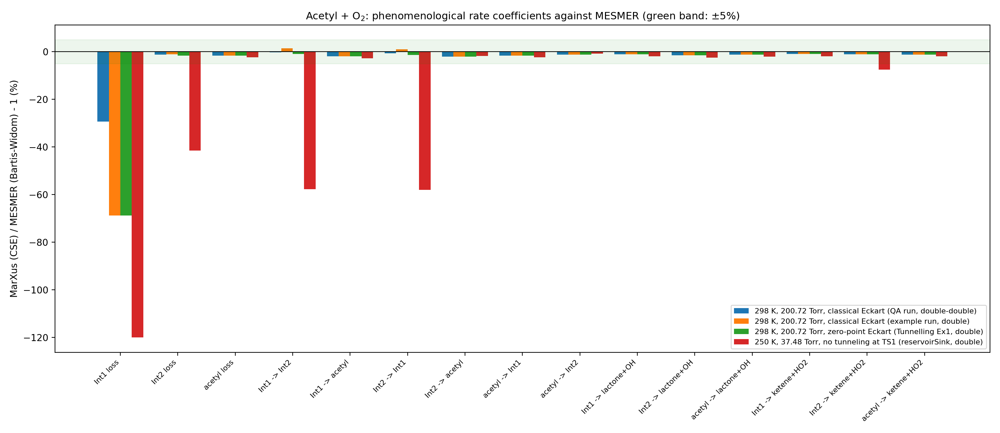
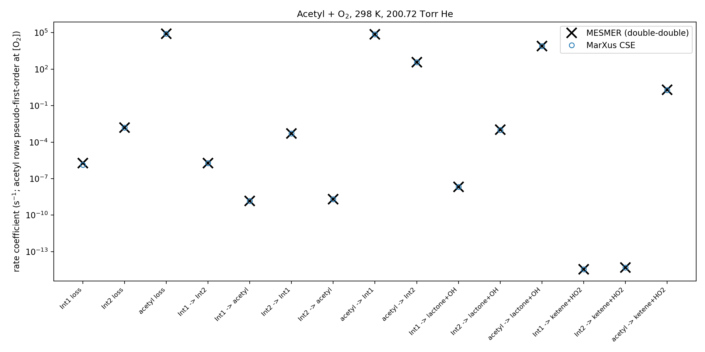
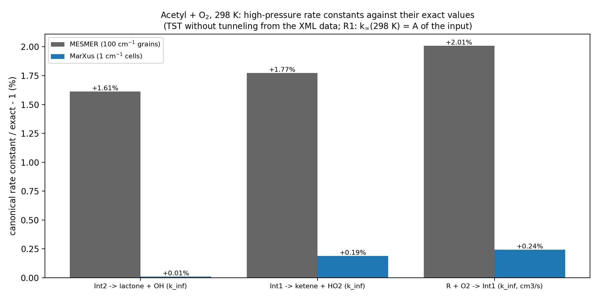
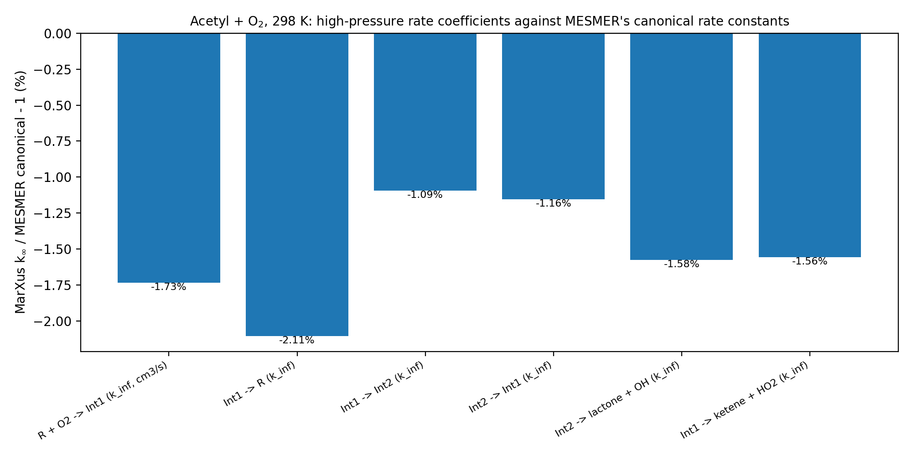

# Validation: acetyl + O₂ ⇌ CH₃C(O)OO → products, MarXus versus stored MESMER results

**System** (MESMER 7.1 example "AcetylO2"; data related to Carr et al., J. Phys. Chem. A 115, 1069 (2011)):
- **Wells:** Int1 (acetylperoxy) and Int2 (peroxide isomer).
- **Source:** the bimolecular reactant acetyl + O₂, associating to Int1 by an inverse Laplace transform (ILT) of k∞(T).
- **Isomerization:** Int1 ⇌ Int2 through TS1, with Eckart tunneling.
- **Sinks:** Int1 → ketene + HO₂ (TS2) and Int2 → lactone + OH (TS3).
- **Bath gas:** He. **Conditions:** 298 K, 200.72 Torr, and 250 K, 37.48 Torr.

**Result:**
- **Partition functions:** MarXus reproduces MESMER's species model exactly.
- **Phenomenological rate coefficients:** −2.1 … +1.4% from MESMER's double-double run, wherever both codes resolve them.
- **The systematic −1 … −2% is MESMER's own grain discretization.** MESMER's canonical rate constants are +1.6 … +2.0% above their exact values; MarXus's are +0.01 … +0.24% (Section 4).

## 1. Contents of this directory

| Path | Content |
|---|---|
| `reference_mesmer/example_AcetylO2/` | MESMER example input `Acetyl_O2_associationEx.xml` and its Linux64 baseline output `mesmer.test`, `mesmer.log` (double precision) |
| `reference_mesmer/qa_double_double/` | MESMER QA input `Acetyl_O2_association.xml` (the same physics, `precision="dd"`) and its baseline output: canonical rate constants, partition functions, all eigenvalues |
| `reference_mesmer/tunnelling_zpe_eckart/` | MESMER Tunnelling examples Ex1 (`me:useZPE`) and Ex2 (explicit zero-point barrier heights) with their outputs |
| `reference_mesmer/reservoir_sink/` | MESMER reservoirSink example: 250 K, 37.48 Torr, no tunneling at TS1, user-sized reservoir states (−2 kJ/mol below the lowest threshold) |
| `make_deck.py` | writes the MarXus decks `input/*.inp` (MESS format) from the MESMER XML inputs |
| `input/acetyl_o2.inp` | 298 K, 200.72 Torr; Eckart at TS1 with classical barrier heights (MESMER default) |
| `input/acetyl_o2_zpe_eckart.inp` | the same with zero-point barrier heights (Tunnelling Ex1/Ex2) |
| `input/acetyl_o2_250K.inp` | 250 K, 37.48 Torr; no tunneling at TS1 (reservoirSink) |
| `run_marxus.sh` | every deck with the four methods (4 cores) |
| `marxus_output/<deck>_<method>.{out,csv,_tables.csv,err}` | MarXus reports, machine-readable tables, warnings |
| `compare_with_mesmer.py` | writes `comparison_table.csv`, `exact_reference.csv` and `plots/*.png` |

All files under `reference_mesmer/` are unchanged copies from the MESMER 7.1 distribution (`examples/AcetylO2`, `MesmerQA/Acetyl O2 association`, `examples/Tunnelling`, `examples/reservoirSink`).

**To reproduce:**

    source ~/.venvs/science/bin/activate && python3 make_deck.py
    ./run_marxus.sh                               # 12 runs, about 15 s on 4 cores
    python3 compare_with_mesmer.py

## 2. The decks: MESMER's model in the MESS format

`make_deck.py` reads the MESMER XML and writes MESS-format decks. Everything is taken from the XML, nothing is typed by hand.

**Species model** (MESMER: quantum harmonic oscillators, `ClassicalRotors`, spin multiplicity):
- Frequencies × `me:frequenciesScaleFactor` (0.9854).
- Classical rigid rotors from `me:rotConsts` with `me:symmetryNumber`.
- Electronic degeneracy = `me:spinMultiplicity`.
- Energies `me:ZPE` (zero-point levels, kJ/mol) relative to acetyl + O₂.

**Rotational constants instead of a geometry.** MESMER gives rotational constants, not geometries. The decks use the MarXus deck keywords `RotationalConstants[1/cm]` (3 values, or 1 for a linear rotor) and `Mass[amu]` in place of `Geometry[angstrom]`. The geometries of the Gaussian logs in the MESMER example would not reproduce MESMER's model: for acetyl, the XML's A = 1.573 cm⁻¹ differs from the 2.855 cm⁻¹ of the log geometry.

**R1 (acetyl + O₂ → Int1).** An `InverseLaplaceTransform` block with k∞(T) = A (T/T∞)ⁿ exp(−E∞/RT): A = 6.00·10⁻¹² cm³ s⁻¹, n = −0.5, T∞ = 298 K, E∞ = 0. The barrier has no geometry and no frequencies: its k(E) comes from k∞ and the reactant states.

**R2 (TS1) — Eckart heights from MESMER's source** (`EckartCoefficients.cpp`, `gDensityOfStates::getClassicalEnergy`):
- **Default:** classical barrier heights V = E_c(TS) − E_c(well), with E_c = ZPE − ½ Σ(unscaled frequencies): V₀ = 11201.41 and V₁ = 10047.25 cm⁻¹. MESMER's printout: 11201.4 and 10047.3.
- **`me:useZPE` (Ex1):** the zero-point barriers, V₀ = 9864.0381 and V₁ = 8833.3298 cm⁻¹. These are identical to Ex2's explicit values.
- **The imaginary frequency** (1688 cm⁻¹) is not scaled.

**Products: `Dummy` species, as in MESS.** MESMER needs no product properties, and lactone has none in the XML; the tight barriers TS2 and TS3 never use the product data.

**Conditions:**
- grain 100 cm⁻¹ (179 grains of Int1, as MESMER);
- grid top 25 kT above the highest barrier;
- exponential down ⟨ΔE_down⟩ = 130 cm⁻¹ (temperature exponent 0);
- Lennard-Jones with He (σ = 3.820 Å, ε = 69.47 K from MESMER's combining rules) and the Neufeld collision integral.

The collision frequency, πσ²⟨v⟩nΩ\*, is 3.66805·10⁹ s⁻¹ at 298 K and 200.72 Torr (T\* = 4.2895, Ω\* = 0.95437, n = 6.50420·10¹⁸ cm⁻³), the value MESMER prints, in all six digits.

**Unit conversion.** kJ/mol → cm⁻¹ with MESMER's factor, 83.5935436 (from Ex2's barrier heights over the zero-point barrier differences).

## 3. Phenomenological rate coefficients (`comparison_table.csv`, `plots/deviation_bartis_widom.png`, `plots/rates_298K.png`)

**Quantities compared.** MarXus CSE against MESMER's Bartis–Widom rate coefficients. MESMER's rates out of acetyl are pseudo-first-order in O₂: k(acetyl → X) = k(R → X)[O₂], with [O₂] = 2.25·10¹⁶ cm⁻³ from `me:excessReactantConc`. "acetyl loss" is the net reaction of R (all formation channels).

**298 K, 200.72 Torr, against MESMER's double-double run:**

| rate coefficient | MESMER | MarXus | deviation |
|---|---|---|---|
| acetyl → Int1 (s⁻¹) | 7.43140·10⁴ | 7.31050·10⁴ | −1.63% |
| acetyl → Int2 | 3.78370·10² | 3.73456·10² | −1.30% |
| acetyl → lactone + OH | 8.07353·10³ | 7.97389·10³ | −1.23% |
| acetyl → ketene + HO₂ | 1.98707 | 1.96187 | −1.27% |
| acetyl loss (net reaction) | 8.27798·10⁴ | 8.14543·10⁴ | −1.60% |
| Int1 → Int2 | 1.88342·10⁻⁶ | 1.87963·10⁻⁶ | −0.20% |
| Int1 → acetyl | 1.50292·10⁻⁹ | 1.47288·10⁻⁹ | −2.00% |
| Int1 → lactone + OH | 2.17185·10⁻⁸ | 2.14709·10⁻⁸ | −1.14% |
| Int1 → ketene + HO₂ | 3.61434·10⁻¹⁵ | 3.57917·10⁻¹⁵ | −0.97% |
| Int2 → Int1 | 5.09588·10⁻⁴ | 5.06109·10⁻⁴ | −0.68% |
| Int2 → acetyl | 2.07040·10⁻⁹ | 2.02596·10⁻⁹ | −2.15% |
| Int2 → lactone + OH | 1.05573·10⁻³ | 1.03914·10⁻³ | −1.57% |
| Int2 → ketene + HO₂ | 5.02425·10⁻¹⁵ | 4.96765·10⁻¹⁵ | −1.13% |
| Int2 loss | 1.56425·10⁻³ | 1.54386·10⁻³ | −1.30% |
| Int1 loss | 1.91065·10⁻⁶ | 1.34966·10⁻⁶ | −29.4% (not resolved, below) |

**Int1 loss is not resolved in double precision.**
- **The eigenvalues.** The chemical eigenvalues are 7.3·10⁻⁷ and 1.5·10⁻³ s⁻¹. The double-precision floor ε·max Sᵢᵢ is 2.3·10⁻⁵ s⁻¹, and MarXus warns that both modes are within a factor 100 of it.
- **What survives.** The diagonal (total loss) of the slower mode is lost, but the individual outflows of Int1 agree. Their sum, 1.9026·10⁻⁶ s⁻¹, is within 0.21% of MESMER's loss.
- **MESMER's own run.** Its double-precision example run differs from its double-double run in exactly these slow entries (Int1 loss 4.33·10⁻⁶ against 1.91·10⁻⁶ s⁻¹), which is why the double-double run is the reference here.

**Other runs** (against MESMER's double-precision runs; ranges over the entries resolved in both codes):
- **Zero-point Eckart (Ex1), 298 K:** −2.15 … −0.97%. Int1 → Int2 is −0.97%, Int2 → Int1 −1.44%.
- **250 K, 37.48 Torr, no tunneling at TS1:**
  - acetyl → X: −2.36 … −0.82%;
  - well → acetyl and well → lactone + OH: −2.72 … −1.85%;
  - Int2 → ketene + HO₂: −7.5% (2.9·10⁻²¹ s⁻¹).
  - The Int1 ⇌ Int2 rate coefficients (~10⁻⁹–10⁻⁷ s⁻¹) and the losses lie below the floor in both codes (MESMER's reference is a double-precision run), and they are not compared.

## 4. Partition functions and canonical rate constants against exact values (`exact_reference.csv`, `plots/canonical_rates*.png`)

**Exact values from the XML data.** The species model of the XML has closed forms: q = q_vib q_rot g_e, with
- quantum harmonic oscillators counted from the zero-point level,
- classical rigid rotors, √π (kT)^{3/2}/(σ√(ABC)) or kT/(σB),
- the spin multiplicity.

For the channels without tunneling, the exact canonical rate constant is k = (k_BT/h)(q‡/q) e^(−ΔE₀/kT).

**Partition functions (MESMER's qtot, 200 and 300 K):** equal to the closed forms within 0.001% for Int1, Int2, TS1, TS2 and TS3, e.g. Int1 at 200 K: 218488 against 218487.4. The XML data and their reading are therefore the same in both codes.

**MarXus partition functions (2026-10-07), at the temperatures of the decks** (rows q(…) at 298 and 250 K in `exact_reference.csv`; MarXus Q from the report section PARTITION FUNCTIONS AND EQUILIBRIUM CONSTANTS):

| species (deck name) | MarXus/exact − 1, 298 K | 250 K | e^{−Δ/2kT} × frequency rounding, 298 K |
|---|---|---|---|
| Int1 | −0.1488% | −0.2066% | −0.1489% |
| Int2 | −0.2043% | −0.2510% | −0.2044% |
| TS1 (B_R2) | −0.3414% | −0.3796% | −0.3415% |
| TS2 (B_R4) | −0.3056% | −0.3330% | −0.3054% |
| TS3 (B_R3) | +0.0027% | −0.0644% | +0.0024% |

The differences come from the 1 cm⁻¹ cell counting, and these two properties reproduce them to 3·10⁻⁶:
- the classical-rotor continuum is counted half a cell high, e^{−Δ/2kT} = 0.99759 at 298 K;
- the scaled frequencies are rounded to the cells (e.g. TS3 +0.244%, TS2 with its 58 cm⁻¹ mode −0.065%).

Details: `../../reports/equilibrium_constants.md` (Sections 4.3 and 5.4).

**Canonical rate constants at 298 K:**

| channel | exact | MESMER (100 cm⁻¹ grains) | MarXus (1 cm⁻¹ cells) |
|---|---|---|---|
| Int2 → lactone + OH (TS3) | 1.282366·10⁻³ s⁻¹ | +1.61% | **+0.011%** |
| Int1 → ketene + HO₂ (TS2) | 4.514260·10⁻¹⁴ s⁻¹ | +1.78% | **+0.19%** |
| acetyl + O₂ → Int1, k∞(298 K) = A | 6.000·10⁻¹² cm³ s⁻¹ | +2.01% | **+0.24%** |

**MarXus against MESMER, canonical:** Int1 → Int2 −1.09%, Int2 → Int1 −1.16%, Int1 → acetyl −2.11%.

**Reading.**
- **MESMER's canonical rate constants lie 1.6–2.0% above their exact values.** They are grain sums with 100 cm⁻¹ grains (0.48 kT): its grained partition function `sumg` is 0.85% below qtot for Int1 and 1.0% below for TS1 at 300 K.
- **MarXus counts states on 1 cm⁻¹ cells** and averages k(E) over the grains with the flux weights, so it stays within 0.25% of the exact values.
- **The systematic −1 … −2% of MarXus against MESMER in Section 3 is this discretization of MESMER**, inherited by its phenomenological rate coefficients.

## 5. Notes

- **Reservoir states.** MESMER's 250 K run uses user-sized reservoir states (−2 kJ/mol below the lowest threshold of each well). MarXus forms a reservoir only where the normalization of the kernel fails (`../../reports/low_energy_reservoir_state.md`); its reservoirs here lie far below every threshold (RUN SETTINGS).
- **OH excited level.** OH carries `me:eletronicExcitation` = 139.7 cm⁻¹ in the XML. The key is misspelled, so MESMER ignores it; OH is only a sink here.
- **HO₂ mass.** The XML gives HO₂ a mass of 42 amu instead of 33; it is not used (HO₂ is a sink).

## 6. History

- **2026-10-07.** MarXus partition functions added to `exact_reference.csv` (Section 4); all runs repeated with the new report sections; `comparison_table.csv` is byte-identical.

- **2026-10-06.** Directory created.
  - New deck keywords for the decks: `RotationalConstants[1/cm]` and `Mass[amu]` in place of a geometry, and `Dummy` bimolecular species (as in MESS). A barrier given by an ILT needs no geometry or frequencies.
  - Every deck runs with the four methods.
