# Validation: H + C₂H₂ ⇌ C₂H₃, MarXus versus stored MESS results

**Date:** 2026-10-06. All MarXus results come from the current working tree (uncommitted) and were run on at most 4 cores.

**Re-run 2026-10-06** with the Neufeld collision integral (the new default); all numbers below are from that run (`../../reports/collision_integral_neufeld.md`).

**Purpose.** Reproduce a published master-equation example with all four MarXus methods:
- SteadyStateOlzmann, the final steady state with its thermal eigenpair, using all three eigen-solvers;
- SteadyStateAbsorbingBarrier, the intermediate steady state;
- CSE, the chemically significant eigenvalues;
- TimeIntegration.

The methods are compared with each other and with MESS. Common settings: 1 cm⁻¹ cells averaged into grains, exact Eckart tunneling (Miller 1979), and an exponential-down kernel with the low-energy reservoir state.

**Reference.** The MESS example set ("Examples_From_Argon"), case `c2h3`: one well and one tight transition state, with and without Eckart tunneling. It is the model of Miller & Klippenstein (2004), H + C₂H₂ (+M) ⇌ C₂H₃ (+M); the PDF `miller2004.pdf` is in the original example directory.

**One directory.** Everything is in this directory, including the eigen-solver study that was previously kept in `../c2h3_mess_example_olzmann_eigen/` (merged on 2026-10-06; results in Section 4.5, history in Section 8).

## 1. Contents of this directory

| Path | Content |
|---|---|
| `input/c2h3_tight.inp` | deck run by both codes: 8 T (300–2000 K) × 5 p (0.1–10 atm), Eckart tunneling |
| `input/c2h3_tight_short.inp` | 1000 K, 1 atm, Eckart tunneling |
| `input/c2h3_tight_short_notunneling.inp` | 1000 K, 1 atm, no tunneling |
| `reference_mess_output/*.out` | stored MESS results for the same decks (unchanged copies) |
| `run_marxus.sh` | builds the MarXus example program and runs every deck with reactant P1 (see below) |
| `marxus_output/<deck>_<method>.{out,csv,_tables.csv}` | one run per method: `olzmann`, `absorbing_barrier`, `cse`, `time_integration`. `*.out` is the report, `*.csv` the machine-readable tables (`--csv`), `*_tables.csv` every table of the report |
| `marxus_output/<deck>_olzmann_{lapack,full}.*` | SteadyStateOlzmann with the other two eigen-solvers. The runs above use the default, inverse iteration. LAPACK runs on all decks; the in-house Householder/QL only on the two 1000 K decks, at about 2 min per condition on the full deck |
| `marxus_output/c2h3_tight_absorbing_barrier_{5,3}kT.*` | absorbing barrier 5 and 3 k_BT below the threshold instead of 10 |
| `plot_comparison.py` | reads all outputs; writes the figures and the three CSV files below |
| `comparison_table.csv` | absorbing-barrier association and the dissociation from the final steady state, against MESS, all 40 conditions |
| `barrier_distance_sensitivity.csv` | association for barrier distances 10, 5 and 3 k_BT, all conditions |
| `plots/deviation.png` | deviation from MESS: SteadyStateOlzmann (top row: k_uni·K association, k_uni dissociation) and SteadyStateAbsorbingBarrier (bottom row) |
| `plots/pes_olzmann.png`, `plots/falloff_W1_P1.png`, `plots/olzmann_deviation.png`, `plots/eigen_vs_absorbing_barrier.png`, `plots/sum_rule.png`, `plots/olzmann_solvers_1000K.png` | the SteadyStateOlzmann figures of the former `../c2h3_mess_example_olzmann_eigen/` (its `deviation.png` and `short_decks_1000K.png` are `olzmann_deviation.png` and `olzmann_solvers_1000K.png` here, because those names are taken) |
| `olzmann_comparison_table.csv` | SteadyStateOlzmann: k_uni, λ₁, sum rule, λ₂/k_uni, association k_uni·K, against MESS, all conditions |
| `time_integration_decay_vs_k_uni.csv` | late-time decay rate of the pulse (TimeIntegration) against the thermal k_uni (SteadyStateOlzmann), 750–2000 K |
| `method_comparison.csv`, `plots/method_*.png` | identities and agreements between the four methods (`../method_comparison.py`, `../../reports/method_comparison.md`) |
| `four_methods_figures.csv`, `plots/mess_four_methods_*.png`, `plots/internal_four_methods_*.png` | the four methods against MESS and against each other: rates, fall-off, yields, deviations, time evolution (`../four_methods_figures.py`, `../../reports/four_methods_figures.md`; Section 4.8) |
| `plots/*.png` | the figures below |
| `input/c2h3_shock_incubation.inp` | shock heating: C₂H₃ thermal at 300 K in a constant 1000 K, 1 atm bath (`Preparation` block, `CompareWithCse 1e-2`; Section 4.9). A MarXus deck, not run by MESS |
| `run_shock_incubation.sh`, `shock_incubation_summary.py` | the shock deck at four grain widths (`EnergyStepOverTemperature` 0.4, 0.2, 0.1, 0.05), and the summary of their observables |
| `marxus_output/c2h3_shock_incubation_de<step>.{out,csv,_tables.csv}`, `shock_incubation_grain_convergence.csv` | the four shock runs and their summary |

The decks are byte-identical copies of `MESS_kinetics/Examples_From_Argon/examples/c2h3/*.inp`, and MarXus reads them unchanged. They contain no `Reactant` line, so the reactant P1 (H + C₂H₂) is given on the command line.

**To reproduce:**

    ./run_marxus.sh                                                      # about 14 min on 4 cores; 11 min of it the time integration of the full deck
    source ~/.venvs/science/bin/activate && python3 plot_comparison.py && python3 ../method_comparison.py && python3 ../four_methods_figures.py

## 2. System and settings

**System.** Zero-point-corrected energies in kcal/mol:
- C₂H₃ (W1): −34.44;
- TS B1: +4.42, Eckart imaginary frequency 872.23 cm⁻¹, well depths 4.42 and 38.86;
- C₂H₂ + H (P1): 0.

**Collisions.**
- Bath gas, Lennard-Jones: ε = 6.95 / 292 cm⁻¹, σ = 2.55 / 4.36 Å, m = 4 / 75 amu.
- Energy transfer: ⟨ΔE_down⟩ = 200 (T/300 K)^0.85 cm⁻¹, ExponentCutoff 15.

| | MESS (stored results) | MarXus |
|---|---|---|
| Energy grid | 0.1 kT per temperature (EnergyStepOverTemperature 0.1). States are counted on 1 cm⁻¹, splined, and evaluated at the grid nodes. | States and all convolutions on 1 cm⁻¹ cells. Grains are 0.1 kT(T_min) wide, with cell-averaged values: 70 cm⁻¹ for the 1000 K decks, 21 cm⁻¹ for the full deck at all T. |
| Grid top | highest barrier + 30 kT (ExcessEnergyOverTemperature) | the same, at the highest temperature of the deck |
| Collision kernel | exponential down, MESS default kernel mode (per-pair factor) | exponential down, exactly normalized (Robertson 2019, eq. 4.16). Where that normalization fails at the sparse well bottom, a low-energy reservoir state (MESMER manual, Sec. 14.2.1): 2 grains at 300 K … 44 grains at 2000 K (Section 4.7) |
| Tunneling | semiclassical P = 1/(1+e^(−S)), S = WKB action of the Eckart potential | **exact Eckart** transmission (Miller 1979, eq. 8), convolved with the TS states (Miller, eq. 9) |
| Rate coefficients | chemically significant eigenvalues | the four methods (Section 4.4) |
| k∞ of the association | from partition functions | canonical sum of the cell numbers of states W(E) e^(−E/kT) over the reactant partition functions (tested against TST to within 0.5%) |

**How each MarXus method gives the rate coefficients of this one-well system:**
- **SteadyStateAbsorbingBarrier.** Association k(P1→W1) = k∞ Φ_stab, with an absorbing barrier 10 kT below the classical threshold (Pilling & Robertson 2003, eq. 44). Dissociation k(W1→P1) = k∞,d Φ_stab by detailed balance; k∞,d comes from the final steady state, which is equilibrium for thermal formation through the only channel (`comparison_table.csv`).
- **SteadyStateOlzmann.** The dissociation is k_uni, the average of k(E) over the thermal eigenvector of 𝐉 (GO10, after eq. 12). The association follows by detailed balance, k(P1→W1) = k_uni·K with K = k∞,a/k∞,d (`olzmann_comparison_table.csv`).
- **CSE.** k(P1→W1) from G13 eq. 28, and k(W1→P1) from eq. 30.
- **TimeIntegration.** The pulse of chemically activated C₂H₃ in time. Its late-time decay rate checks k_uni (`time_integration_decay_vs_k_uni.csv`).

## 3. Potential-energy surface

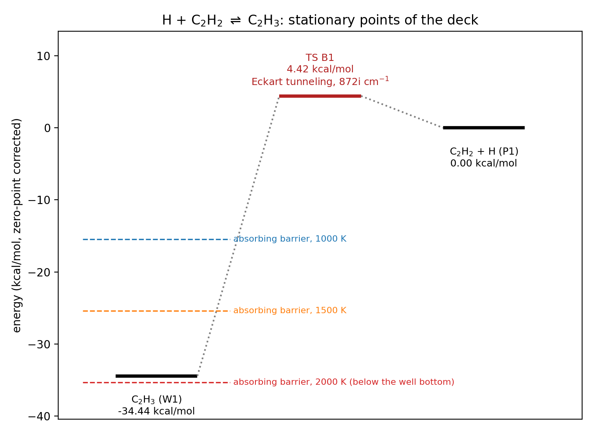

The figure shows the stationary points of the deck, with the TS and its Eckart parameters. The dashed lines are the absorbing barriers of SteadyStateAbsorbingBarrier, 10 kT below the classical threshold:

| T | absorbing barrier |
|---|---|
| 1000 K | 9.6 kT above the well bottom |
| 1500 K | only 3 kT above the bottom |
| 2000 K | below the bottom |

## 4. Results

### 4.1 1000 K, 1 atm, with and without tunneling (short decks)

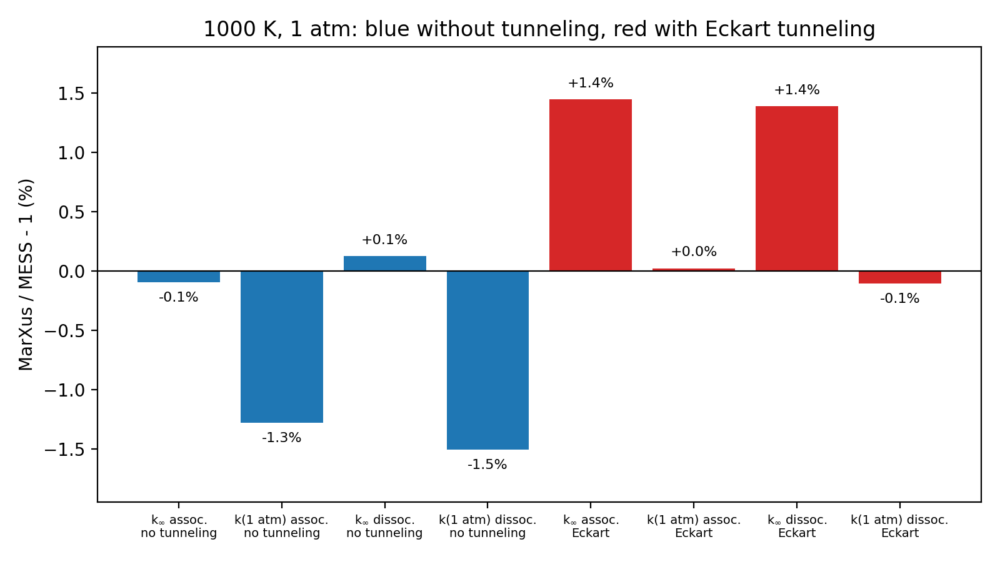

| | MESS | absorbing barrier | SteadyStateOlzmann | CSE |
|---|---|---|---|---|
| **no tunneling:** k∞(P1→W1), cm³ s⁻¹ | 3.88e-11 | 3.876e-11 (−0.1%) | | |
| k(P1→W1, 1 atm) | 2.34e-12 | 2.3290e-12 (−0.5%) | 2.3288e-12 (−0.5%) | 2.3288e-12 (−0.5%) |
| k(W1→P1, 1 atm), s⁻¹ | 1.46e4 | | 1.44975e4 (−0.7%) | 1.44975e4 (−0.7%) |
| **Eckart:** k∞(P1→W1) | 4.0860e-11 | 4.145e-11 (+1.4%) | | |
| k(P1→W1, 1 atm) | 2.5705e-12 | 2.5918e-12 (+0.83%) | 2.5916e-12 (+0.82%) | 2.5916e-12 (+0.82%) |
| k(W1→P1, 1 atm) | 1.6022e4 | | 1.61335e4 (+0.69%) | 1.61335e4 (+0.69%) |

- The MESS values without tunneling are printed with three digits only.
- The three eigen-solvers of SteadyStateOlzmann give the same k_uni to 7 digits, 16133.47 and 14497.47 s⁻¹. Their sum-rule deviations are 4.4·10⁻¹² (inverse iteration), 2.9·10⁻¹¹ (LAPACK) and 2.6·10⁻¹⁰ (QL) with tunneling.

### 4.2 High-pressure limits (full deck, Eckart)

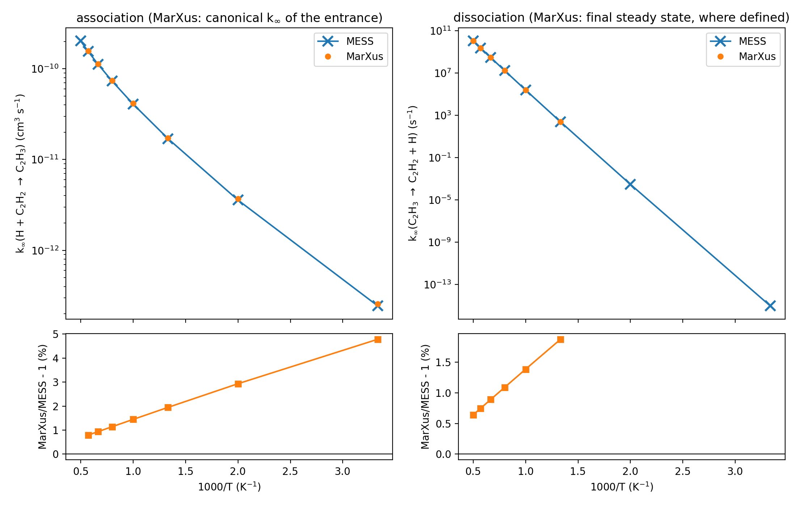

| T (K) | MESS k∞(P1→W1) | MarXus | Δ | MESS k∞(W1→P1) | MarXus | Δ |
|---|---|---|---|---|---|---|
| 300 | 2.4433e-13 | 2.5602e-13 | +4.8% | 9.5862e-16 | — | — |
| 500 | 3.5805e-12 | 3.6855e-12 | +2.9% | 2.9835e-04 | — | — |
| 750 | 1.6985e-11 | 1.7316e-11 | +1.9% | 2.4393e+02 | 2.4851e+02 | +1.9% |
| 1000 | 4.0861e-11 | 4.1451e-11 | +1.4% | 2.5451e+05 | 2.5804e+05 | +1.4% |
| 1250 | 7.3151e-11 | 7.3985e-11 | +1.1% | 1.7464e+07 | 1.7655e+07 | +1.1% |
| 1500 | 1.1180e-10 | 1.1285e-10 | +0.9% | 3.0096e+08 | 3.0364e+08 | +0.9% |
| 1750 | 1.5523e-10 | 1.5646e-10 | +0.8% | 2.3332e+09 | 2.3507e+09 | +0.7% |
| 2000 | 2.0230e-10 | — | — | 1.0932e+10 | 1.1002e+10 | +0.6% |

**Missing values.**
- **k∞,d at 300 and 500 K.** It is taken from the final steady state, which is numerically singular for this 34 kcal/mol well without a sink (double precision; "not available" in `marxus_output/c2h3_tight_olzmann.out`). The thermal eigenpair exists there (Section 4.5).
- **Association at 2000 K.** The program prints k∞ next to the intermediate steady state, which is not defined at 2000 K (Section 5.3).

**Both directions deviate by the same amount**, as detailed balance requires: both codes use the same equilibrium constant. The deviation grows from +0.6% at 2000 K to +4.8% at 300 K. This is the exact Eckart transmission (MarXus) against the semiclassical one (MESS), Section 5.2. The high-pressure limits do not depend on the collision kernel.

### 4.3 Fall-off: absorbing barrier and final steady state (full deck, Eckart)

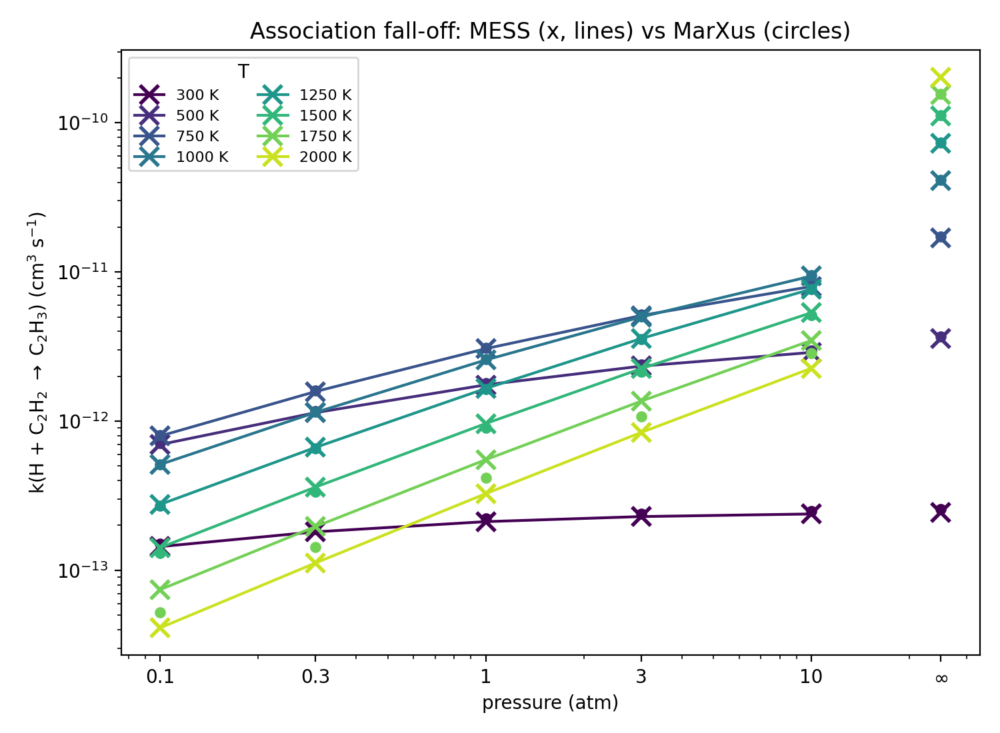

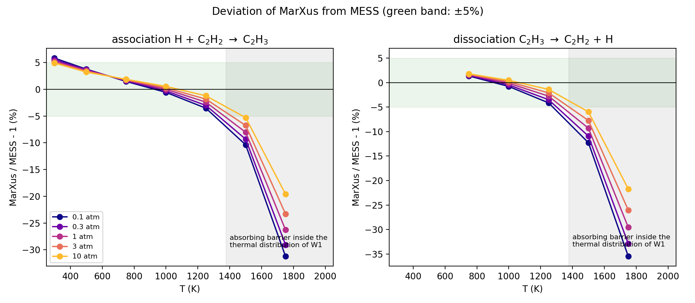

**`deviation.png`, top row: SteadyStateOlzmann** (`olzmann_comparison_table.csv`): association k_uni·K by detailed balance, dissociation k_uni from the thermal eigenvector, all 40 conditions.

**`deviation.png`, bottom row, and the table below: SteadyStateAbsorbingBarrier** (`comparison_table.csv`):
- association: k∞(T) Φ_stab (10 kT);
- dissociation: k∞,d(T) Φ_stab, with k∞,d from the final steady state (750–2000 K).

| T (K) | p (atm) | MESS k(P1→W1) | MarXus | Δ | MESS k(W1→P1) | MarXus | Δ |
|---|---|---|---|---|---|---|---|
| 300 | 0.1 | 1.4421e-13 | 1.5077e-13 | +4.5% | 5.6580e-16 | — | — |
| 300 | 0.3 | 1.8112e-13 | 1.8955e-13 | +4.7% | 7.1063e-16 | — | — |
| 300 | 1 | 2.1202e-13 | 2.2205e-13 | +4.7% | 8.3187e-16 | — | — |
| 300 | 3 | 2.2930e-13 | 2.4024e-13 | +4.8% | 8.9965e-16 | — | — |
| 300 | 10 | 2.3870e-13 | 2.5015e-13 | +4.8% | 9.3652e-16 | — | — |
| 500 | 0.1 | 6.9740e-13 | 7.1576e-13 | +2.6% | 5.8116e-05 | — | — |
| 500 | 0.3 | 1.1408e-12 | 1.1719e-12 | +2.7% | 9.5065e-05 | — | — |
| 500 | 1 | 1.7523e-12 | 1.8015e-12 | +2.8% | 1.4601e-04 | — | — |
| 500 | 3 | 2.3395e-12 | 2.4065e-12 | +2.9% | 1.9494e-04 | — | — |
| 500 | 10 | 2.8901e-12 | 2.9742e-12 | +2.9% | 2.4082e-04 | — | — |
| 750 | 0.1 | 7.9550e-13 | 8.0704e-13 | +1.4% | 1.1429e+01 | 1.1582e+01 | +1.3% |
| 750 | 0.3 | 1.5805e-12 | 1.6053e-12 | +1.6% | 2.2704e+01 | 2.3039e+01 | +1.5% |
| 750 | 1 | 3.0644e-12 | 3.1161e-12 | +1.7% | 4.4016e+01 | 4.4721e+01 | +1.6% |
| 750 | 3 | 5.1099e-12 | 5.2005e-12 | +1.8% | 7.3391e+01 | 7.4637e+01 | +1.7% |
| 750 | 10 | 8.0055e-12 | 8.1537e-12 | +1.9% | 1.1497e+02 | 1.1702e+02 | +1.8% |
| 1000 | 0.1 | 5.1285e-13 | 5.1474e-13 | +0.4% | 3.1993e+03 | 3.2044e+03 | +0.2% |
| 1000 | 0.3 | 1.1451e-12 | 1.1517e-12 | +0.6% | 7.1401e+03 | 7.1697e+03 | +0.4% |
| 1000 | 1 | 2.5737e-12 | 2.5942e-12 | +0.8% | 1.6042e+04 | 1.6150e+04 | +0.7% |
| 1000 | 3 | 4.9976e-12 | 5.0466e-12 | +1.0% | 3.1142e+04 | 3.1416e+04 | +0.9% |
| 1000 | 10 | 9.3954e-12 | 9.5032e-12 | +1.1% | 5.8533e+04 | 5.9160e+04 | +1.1% |
| 1250 | 0.1 | 2.7659e-13 | 2.7136e-13 | −1.9% | 6.6421e+04 | 6.4756e+04 | −2.5% |
| 1250 | 0.3 | 6.6713e-13 | 6.5756e-13 | −1.4% | 1.6000e+05 | 1.5691e+05 | −1.9% |
| 1250 | 1 | 1.6573e-12 | 1.6420e-12 | −0.9% | 3.9695e+05 | 3.9182e+05 | −1.3% |
| 1250 | 3 | 3.5798e-12 | 3.5633e-12 | −0.5% | 8.5656e+05 | 8.5031e+05 | −0.7% |
| 1250 | 10 | 7.6924e-12 | 7.6930e-12 | +0.0% | 1.8389e+06 | 1.8358e+06 | −0.2% |
| 1500 | 0.1 | 1.4204e-13 | 1.3018e-13 | −8.3% | 3.9042e+05 | 3.5028e+05 | −10.3% |
| 1500 | 0.3 | 3.6165e-13 | 3.3512e-13 | −7.3% | 9.9060e+05 | 9.0171e+05 | −9.0% |
| 1500 | 1 | 9.6459e-13 | 9.0561e-13 | −6.1% | 2.6318e+06 | 2.4367e+06 | −7.4% |
| 1500 | 3 | 2.2504e-12 | 2.1396e-12 | −4.9% | 6.1189e+06 | 5.7571e+06 | −5.9% |
| 1500 | 10 | 5.3391e-12 | 5.1475e-12 | −3.6% | 1.4469e+07 | 1.3850e+07 | −4.3% |
| 1750 | 0.1 | 7.4261e-14 | 5.2478e-14 | −29.3% | 1.1890e+06 | 7.8845e+05 | −33.7% |
| 1750 | 0.3 | 1.9658e-13 | 1.4317e-13 | −27.2% | 3.1213e+06 | 2.1510e+06 | −31.1% |
| 1750 | 1 | 5.5199e-13 | 4.1755e-13 | −24.4% | 8.6792e+06 | 6.2735e+06 | −27.7% |
| 1750 | 3 | 1.3623e-12 | 1.0712e-12 | −21.4% | 2.1226e+07 | 1.6094e+07 | −24.2% |
| 1750 | 10 | 3.4783e-12 | 2.8627e-12 | −17.7% | 5.3670e+07 | 4.3010e+07 | −19.9% |
| 2000 | 0.1 | 4.1158e-14 | — | — | 2.5837e+06 | — | — |
| 2000 | 0.3 | 1.1207e-13 | — | — | 6.9238e+06 | — | — |
| 2000 | 1 | 3.2672e-13 | — | — | 1.9798e+07 | — | — |
| 2000 | 3 | 8.4038e-13 | — | — | 4.9970e+07 | — | — |
| 2000 | 10 | 2.2655e-12 | — | — | 1.3188e+08 | — | — |

### 4.4 The four methods

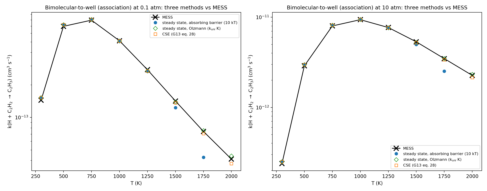

**Association and dissociation against MESS.** Each cell is the range over the five pressures (`method_comparison.csv`):

| T (K) | dissociation, CSE = SteadyStateOlzmann (k_uni) | association, CSE (G13 eq. 28) | association, SteadyStateOlzmann (k_uni·K) | association, SteadyStateAbsorbingBarrier |
|---|---|---|---|---|
| 300 | +4.4 … +4.6% | +4.5 … +4.8% | +4.5 … +4.8% | +4.5 … +4.8% |
| 500 | +2.5 … +2.8% | +2.6 … +2.9% | +2.6 … +2.9% | +2.6 … +2.9% |
| 750 | +1.3 … +1.8% | +1.4 … +1.8% | +1.4 … +1.8% | +1.4 … +1.9% |
| 1000 | +0.1 … +1.1% | +0.3 … +1.1% | +0.3 … +1.1% | +0.4 … +1.1% |
| 1250 | −1.3 … +0.2% | −0.9 … +0.4% | −0.7 … +0.4% | −1.9 … +0.0% |
| 1500 | −1.4 … −0.1% | −0.9 … +0.0% | +0.6 … +0.8% | −8.3 … −3.6% |
| 1750 | +0.0 … +0.4% | +0.2 … +0.4% | +3.1 … +6.6% | −29.3 … −17.7% |
| 2000 | +0.3 … +0.4% | +0.3 … +0.5% | +8.2 … +16.5% | not defined |

**Reading the table:**
- **CSE's dissociation equals SteadyStateOlzmann's k_uni** at every condition (the one-well identity; Section 4.6).
- **Up to 1000 K the four associations agree with each other.** CSE vs k_uni·K: 0.00 … −0.02%. Absorbing barrier vs k_uni·K: 0.00 … +0.02%.
- **Above 1000 K they separate** (Section 5.4):
  - the absorbing barrier loses its plateau;
  - CSE's association departs from k_uni·K by exactly its departure from detailed balance, which grows with the eigenvalue separation Λ₁/Λ₂, as MESS's does.
- **MESS, itself a CSE code, and MarXus's CSE agree within −1.4 … +0.5% at 1250–2000 K** (association −0.9 … +0.5%, dissociation −1.4 … +0.4%).

**TimeIntegration** (pulse of chemically activated C₂H₃, Rodas4, 10⁻¹² … 10² s):

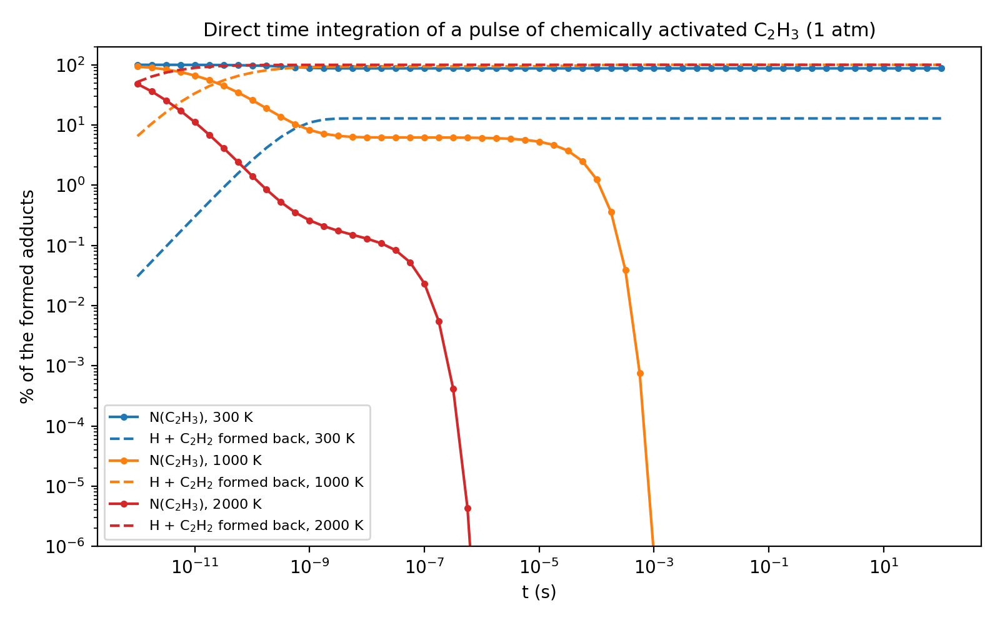

- **Late-time decay = k_uni.**
  - Once only the thermal eigenmode is left, N(t) decays at the rate k_uni of SteadyStateOlzmann.
  - The decay rate from the last two output times with 10⁻⁸ < N < 10⁻³ agrees with k_uni within 4.0·10⁻⁶ at all 30 conditions that decay inside the window (750–2000 K; `time_integration_decay_vs_k_uni.csv`).
  - The time integration computes no eigenvector.
- **Time scales at 1 atm:**
  - 300 K: 13.3% redissociates within about 10⁻⁹ s, and 86.7% stays as C₂H₃ until 100 s (k_uni = 8.7·10⁻¹⁶ s⁻¹).
  - 1000 K: the stabilized C₂H₃ decomposes thermally near 10⁻⁴ s; at 100 s, 100% is back as H + C₂H₂.
  - 2000 K: the same by 10⁻⁷ s.
- **Cost.** 619–977 Rosenbrock steps per condition (22 rejected over all 40 conditions) and 112–132 factorizations. The full deck takes 11 min on 4 cores, because the collision band reaches 716 grains at 2000 K.

**Yields** (`plots/yields.png`; MESS as k/k∞): the stabilization of C₂H₃ and the prompt redissociation to H + C₂H₂, in % of the formed adducts, against pressure.

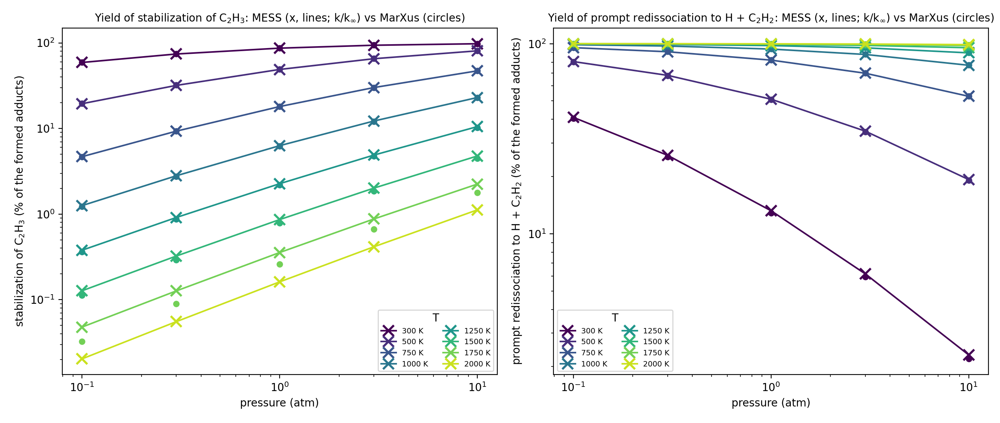

### 4.5 SteadyStateOlzmann: the thermal eigenpair and the three eigen-solvers

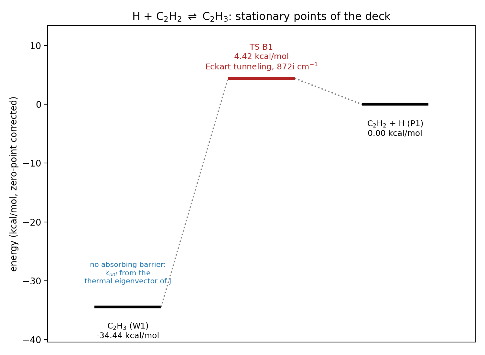

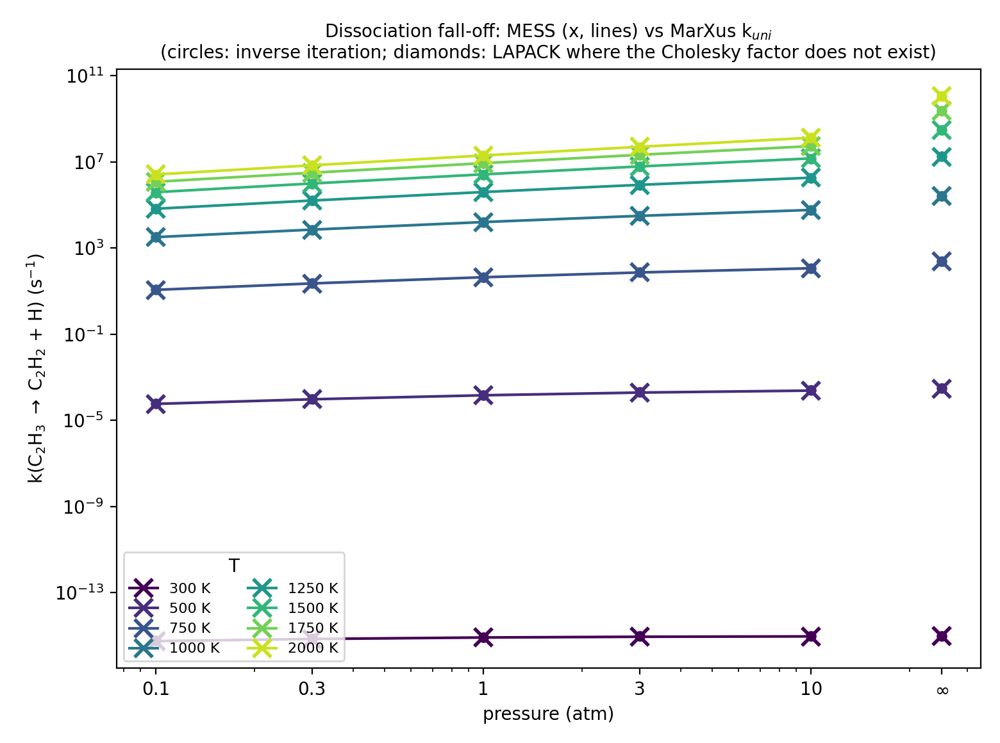

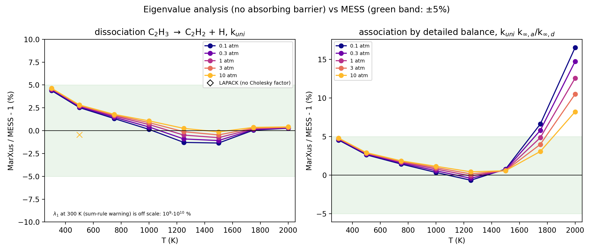

**Method.**
- **Reported rate coefficient.** k_uni = Σᵢ k(Eᵢ) Ñᵢ, the specific rate coefficients averaged over Ñ, the normalized eigenvector of the lowest eigenvalue λ₁ of 𝐉. GO10, text after eq. 12: "analogous to eqn (9) but with Ñs = Ñs^th being the normalized eigenvector associated with the lowest eigenvalue λ₁".
- **λ₁** is printed beside k_uni (GO10 eq. 12). The column sums of 𝐉 are the loss rates, so λ₁ = k_uni exactly in exact arithmetic.
- **Numerical sensitivity.**
  - λ₁ has an absolute error of order ε‖S‖ (Weyl), and it is the first quantity lost when it lies many orders below the collision frequency.
  - The eigenvector is much less sensitive: its error scales with ε‖S‖/λ₂.
  - The precision floor ε·max Sᵢᵢ is printed. The sum rule |λ₁ − k_uni|/k_uni warns above 1.5% and never rejects.

**Solvers** (`--eigen-solver`):

| solver | method | cost |
|---|---|---|
| `inverse` (default) | inverse iteration with the banded Cholesky factor of S + σI, σ = n·ε·max Sᵢᵢ (shifted inverse iteration, Numerical Recipes §11.7); λ₂ by deflation | O(n·bw²) |
| `lapack` | LAPACK DSYEVD (Householder + divide and conquer, system OpenBLAS), all eigenpairs | O(n³), blocked |
| `full` | in-house Householder (tred2) + implicit QL (tql2), all eigenpairs, Olzmann's route | O(n³), unblocked |

**Sum-rule deviation** |λ₁ − k_uni|/k_uni by temperature, over the five pressures (`plots/sum_rule.png`):

| T (K) | inverse iteration | LAPACK DSYEVD |
|---|---|---|
| 300 | 4·10⁷ … 2·10¹⁰ (warnings) | 4·10⁸ … 2·10¹¹ (warnings) |
| 500 | 1·10⁻⁴ … 3·10⁻² (1 warning) | 2·10⁻⁴ … 2 (warnings) |
| 750 | 7·10⁻¹² … 5·10⁻⁸ | 7·10⁻⁸ … 1·10⁻⁵ |
| 1000 | 6·10⁻¹³ … 5·10⁻¹¹ | 6·10⁻¹⁰ … 3·10⁻⁸ |
| 1250–2000 | 2·10⁻¹⁵ … 2·10⁻¹² | 8·10⁻¹² … 7·10⁻¹⁰ |

Warnings on the full deck: 6 for inverse iteration, 7 for LAPACK.

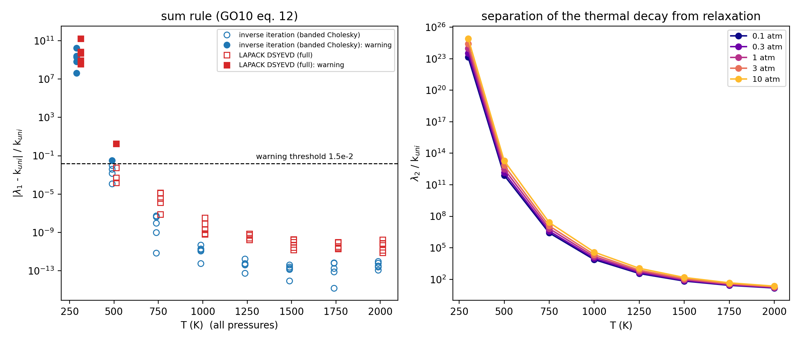

**300 K: complete results from the thermal eigenvector, while λ₁ is noise.**
- λ₁ ≈ 10⁻¹⁵ s⁻¹ lies 13 orders below the double-precision floor (≈ 10⁻² s⁻¹). Its computed values are ±10⁻⁸ … 10⁻⁵ s⁻¹, and the warnings say so.
- The shifted inverse iteration still gives k_uni at all five pressures. It agrees with LAPACK to 2·10⁻⁴ and with MESS to +4.4 … +4.6% (the tunneling offset).
- **Why k_uni survives.** The eigenvector error is of order ε‖S‖/(λ₂ − λ₁), and here λ₂/k_uni = 10²³ … 10²⁵.

**Separation λ₂/k_uni** (thermal decay vs relaxation): 10²³–10²⁵ at 300 K, 10¹²–10¹³ at 500 K, 10³–10⁴ at 1000 K, 68–150 at 1500 K, 15–22 at 2000 K.

**Association with three barrier distances against SteadyStateOlzmann** (`plots/eigen_vs_absorbing_barrier.png`):

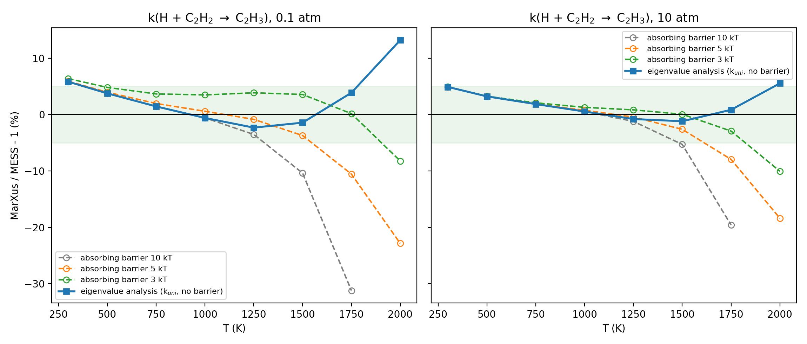

**The three solvers at 1000 K, 1 atm** (short decks, `plots/olzmann_solvers_1000K.png`): identical k_uni and association to 7 digits (Section 4.1).

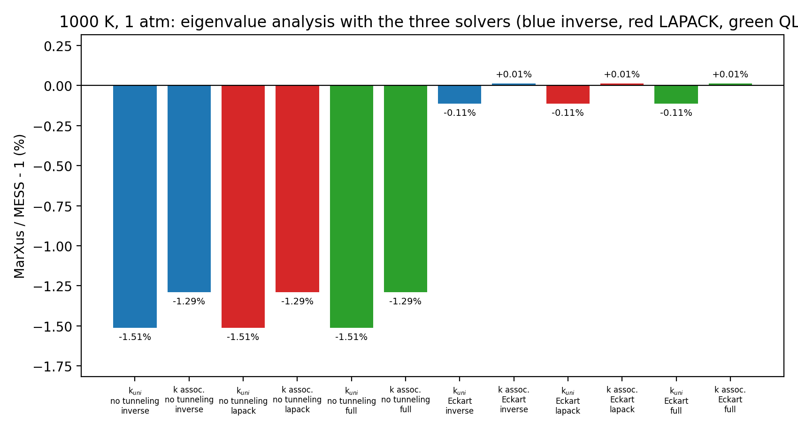

**Timing**, full deck (2634 grains), from the earlier eigen-solver study (`../../reports/eigen_solvers_lapack_and_davidson_assessment.md`), two conditions:

| solver | time | memory |
|---|---|---|
| inverse | 6.3 s | 137 MB |
| LAPACK | 5.0 s | 391 MB |
| QL | 238 s | 269 MB |

### 4.6 Identities and agreement between the methods

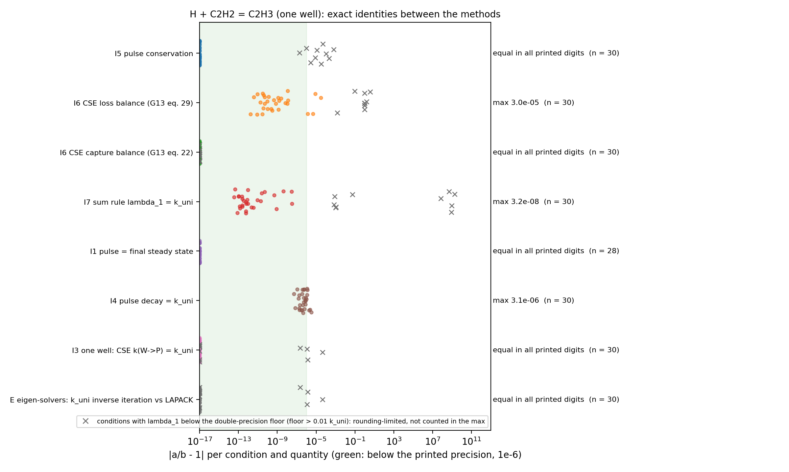

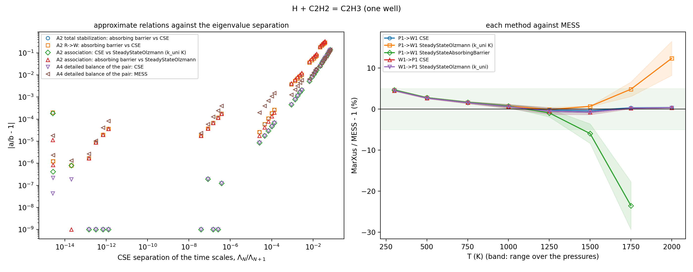

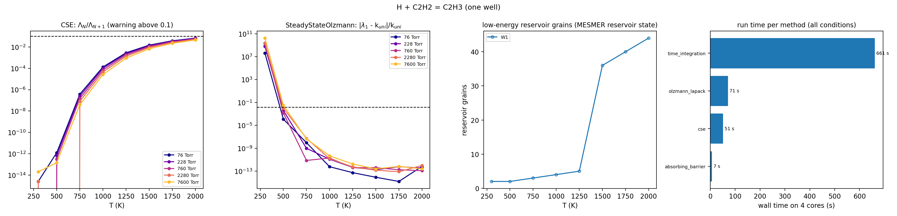

**Source.** `method_comparison.csv`, `../method_comparison.py`; full description in `../../reports/method_comparison.md`.

**Exact identities**, at the 30 conditions where λ₁ is resolved (750–2000 K):
- **Equal in all printed digits:**
  - pulse = final steady state;
  - pulse conservation;
  - CSE k(W1 → P1) = k_uni;
  - inverse iteration = LAPACK;
  - CSE capture balance.
- **Pulse decay = k_uni:** 4.0·10⁻⁶.
- **CSE loss balance:** 1.4·10⁻⁵.
- **Sum rule:** 5.3·10⁻⁸.

**At 300–500 K (grey crosses in the plot)** the precision floor exceeds k_uni by 40 … 10¹³. Pulse conservation (up to 7·10⁻⁴), CSE's loss balance and λ₁ are rounding-limited there; this is the known double-precision limit for a deep well without a sink.

**Run time on 4 cores** (40 conditions): absorbing barrier 7 s, CSE 51 s, SteadyStateOlzmann with LAPACK 71 s, TimeIntegration 661 s.

### 4.7 Low-energy reservoir

**Where it forms.** The normalization of the exponential-down kernel (Robertson 2019, eq. 4.16) fails at the sparse bottom of C₂H₃. The grains from the failing one down form one thermalized reservoir state (MESMER manual, Sec. 14.2.1; `../../reports/low_energy_reservoir_state.md`).

**Reservoir grains** (RUN SETTINGS):

| T (K) | 300 | 500 | 750 | 1000 | 1250 | 1500 | 1750 | 2000 |
|---|---|---|---|---|---|---|---|---|
| grains | 2 | 2 | 3 | 4 | 5 | 36 | 40 | 44 |
| top (cm⁻¹ above the bottom) | 42 | 42 | 63 | 84 | 105 | 756 | 840 | 924 |

The threshold lies 13 591 cm⁻¹ above the bottom.

**Effect.** The reservoir keeps the Boltzmann weight of its grains, so k_uni and the detailed balance of CSE are not affected.
- **Against MESS-type truncation.** Truncating these grains raised k_uni by 2.5% at 300 K.
- **Against the former SSUMES-type reduction factors.** Those acted on up to 300 grains at 2000 K and gave k_uni −7.8 … −4.5% and a CSE association −9.1 … −4.9% from MESS there. With the reservoir both were −2.6 … −2.1% (Troe collision integral of that comparison). With the reservoir and the Neufeld collision integral they are +0.3 … +0.4% (k_uni) and +0.3 … +0.5% (CSE association) (`../../reports/collision_integral_neufeld.md`).

### 4.8 The four methods against MESS and against each other

Figures of `../four_methods_figures.py` (all numbers in `four_methods_figures.csv`; quantities and definitions in `../../reports/four_methods_figures.md`).

**Quantities per method.**
- **Association:** SteadyStateOlzmann k_uni·K; SteadyStateAbsorbingBarrier k_∞·Φ_stab; CSE G13 eq. 28; TimeIntegration k_∞·A, with A the amplitude of the slowest mode of the pulse extrapolated to t = 0.
- **Dissociation:** k_uni; k_∞,d·Φ_stab; CSE k(W1 → P1); the late decay rate of the pulse (750–2000 K).
- **TimeIntegration association = CSE association, identically.** For one well A = (Σ f⁽¹⁾)(Σ f⁽¹⁾ k_R)/Σ k_R f⁰ = k(R → W)/k_∞ of G13 eq. 28. Measured: within 1.9·10⁻⁴ at all 40 conditions (3.3·10⁻⁵ at 750–2000 K).

**Against MESS** (ranges over the pressures):

| method | quantity | 300–500 K | 750–1250 K | 1500–2000 K |
|---|---|---|---|---|
| SteadyStateOlzmann | association / dissociation | +2.6 … +4.8% / +2.5 … +4.6% | −0.7 … +1.8% / −1.3 … +1.8% | +0.6 … +16.5% / −1.4 … +0.4% |
| SteadyStateAbsorbingBarrier | association / dissociation | +2.6 … +4.8% / +2.5 … +4.6% | −1.9 … +1.9% / −2.5 … +1.8% | −29.3 … −3.6% / −33.7 … −4.3% (no 2000 K) |
| CSE | association / dissociation | +2.6 … +4.8% / +2.5 … +4.6% | −0.9 … +1.8% / −1.3 … +1.8% | −0.9 … +0.5% / −1.4 … +0.4% |
| TimeIntegration | association / dissociation | +2.6 … +4.8% / not resolved | −0.9 … +1.8% / −1.3 … +1.8% | −0.9 … +0.5% / −1.4 … +0.4% |

**Yields against MESS** (stabilization = k/k_∞; MESS from its own tables):
- **Stabilization**, all four methods at 300–500 K: −0.29 … +0.01%. The +3 … +5% of k_∞ (the tunneling model) cancels in k/k_∞.
- **Prompt redissociation:** −0.50 … +0.36% at 300–500 K, within 0.5% above.

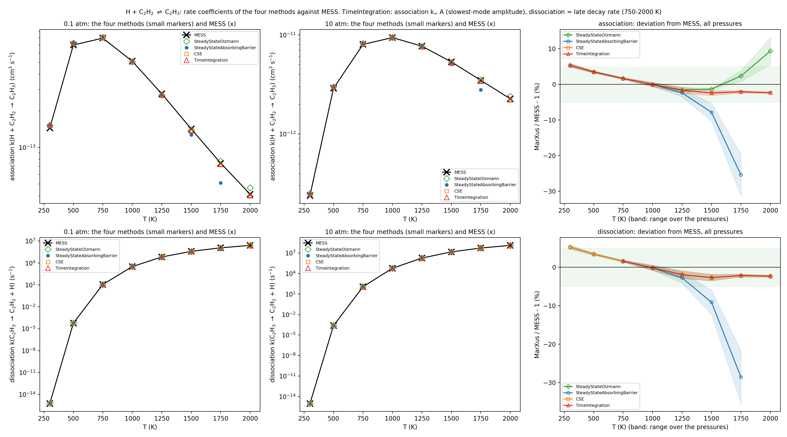

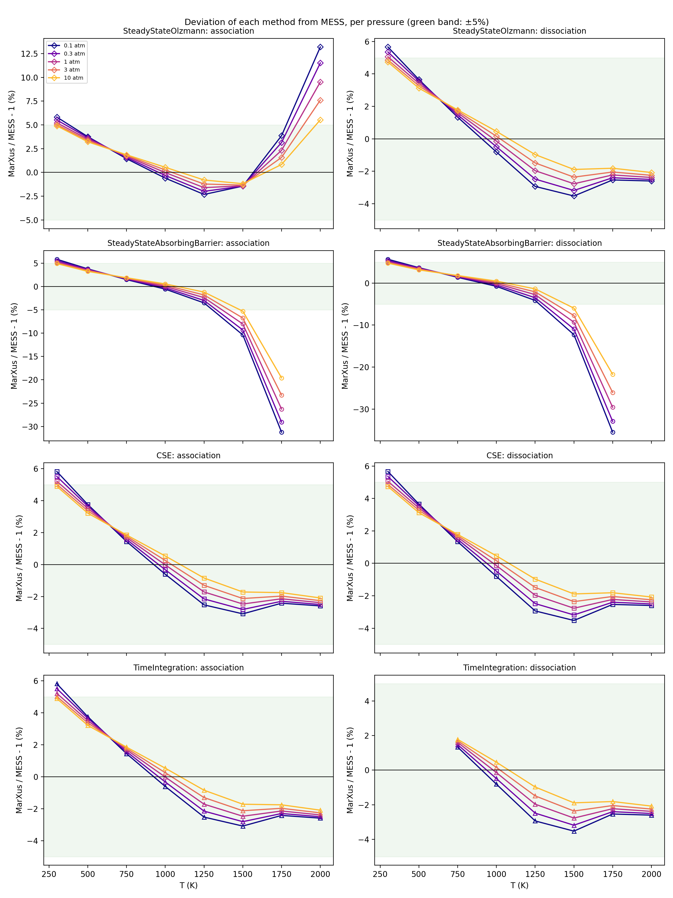

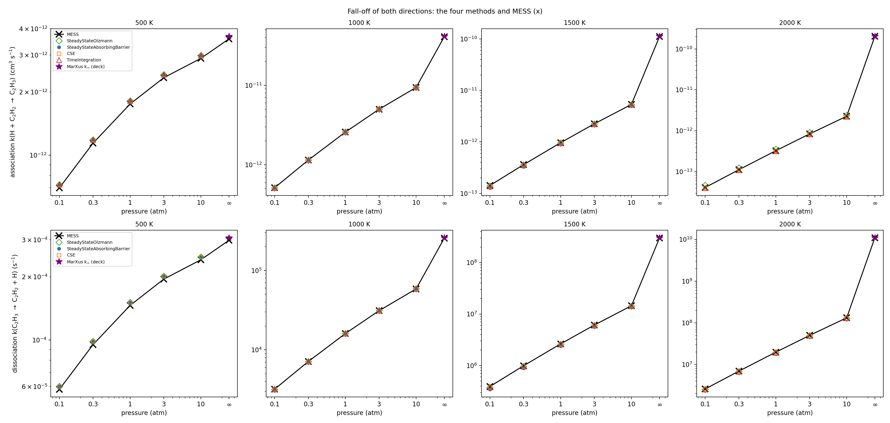

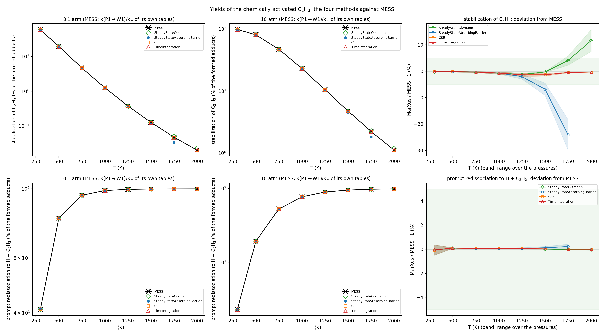

**Against each other** (`plots/internal_four_methods_*.png`):
- **Dissociation:** CSE = SteadyStateOlzmann in all printed digits at 750–2000 K; TimeIntegration decay = k_uni within 4.0·10⁻⁶; SteadyStateAbsorbingBarrier within 1.2% up to 1250 K, −34 … −4% at 1500–1750 K.
- **Association against SteadyStateOlzmann:** CSE and TimeIntegration within 2·10⁻⁴ at 300–500 K, −0.21 … 0% at 750–1250 K, −13.9 … −0.5% at 1500–2000 K (the CSE pair departs from detailed balance at poor separation, Section 5.4). SteadyStateAbsorbingBarrier −1.2 … +0.02% at 750–1250 K, −33.7 … −4.1% at 1500–1750 K.
- **Prompt redissociation:** all within 0.47% of SteadyStateOlzmann.
- **Time evolution:**
  - At 300 and 1000 K the pulse reaches a plateau equal to the stabilization yield of every method. It then decays as (k(R → W)/k_∞) exp(−k(W → P) t) of CSE and SteadyStateOlzmann.
  - At 2000 K there is no plateau.

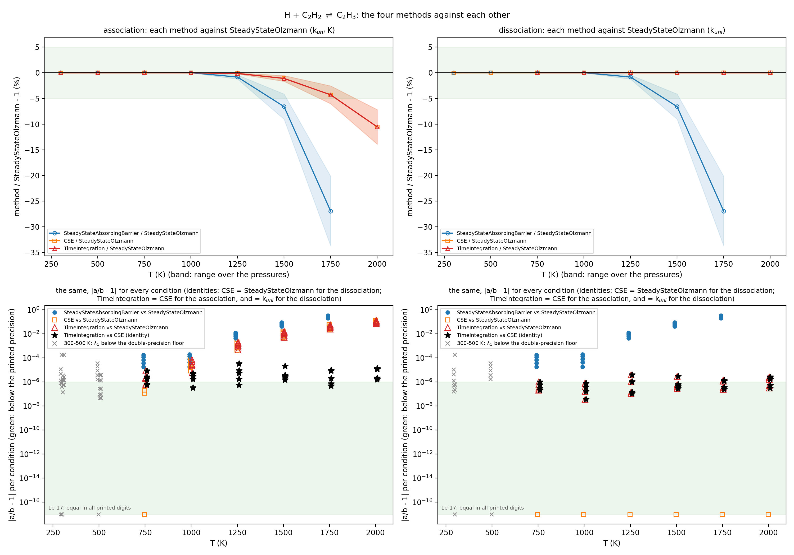

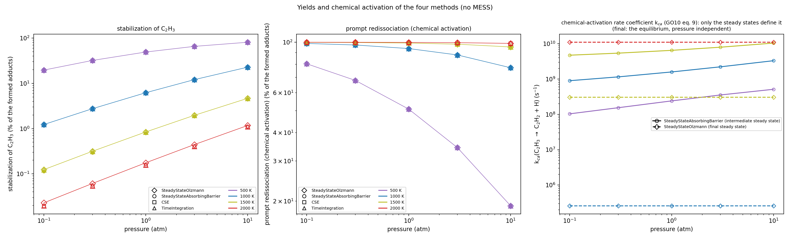

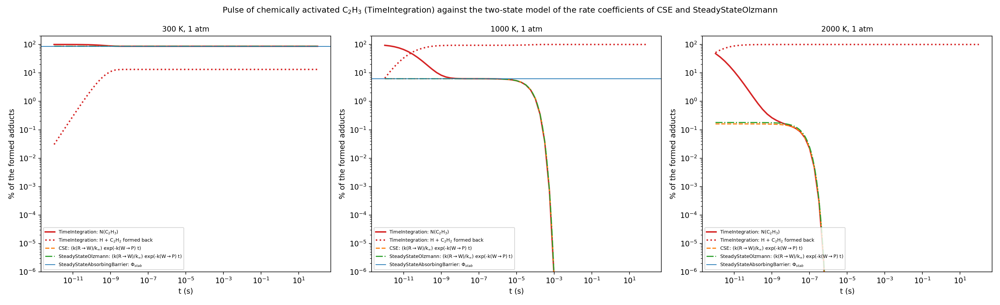

### 4.9 Shock heating: incubation, relaxation and the CSE description in time

**Setup:**
- **Deck:** `input/c2h3_shock_incubation.inp`, the molecular data of the decks above.
- **Preparation:** C₂H₃ (W1) thermal at 300 K, put at t = 0 into a constant bath of 1000 K and 1 atm, as behind a shock wave.
- **Method:** `Method TimeIntegration`, 8 output times per decade, relative tolerance 10⁻⁸; `CompareWithCse 1e-2`.
- **Design:** `../../reports/nonthermal_sources_design.md`, Section 12.

**Observables:**
- the incubation time τ_inc (Barker, King, J. Chem. Phys. 103, 4953 (1995), eq. 9);
- the vibrational relaxation time τ_vib (their eq. 11) and the final steady-state energy E_f;
- the flux coefficient r(W1→P1) (Barker, Frenklach, Golden, J. Phys. Chem. A 119, 7451 (2015), eq. A5);
- the CSE description propagated in time (Miller et al., J. Phys. Chem. A 120, 306 (2016)).

**Results** (grain 70 cm⁻¹):
- τ_inc = 12.47 ns = 62.6 collisions;
- τ_vib at τ_inc = 4.08 ns;
- k_uni = 1.44975·10⁴ s⁻¹ (the late flux coefficient), equal to all six printed digits to k_uni of SteadyStateOlzmann in `marxus_output/c2h3_tight_short_notunneling_olzmann.out`. The shock deck has the molecular data of `examples/c2h3_chemical_activation.inp`, which has no Eckart tunneling, and the same grains;
- the lowest relaxation eigenvalue is 2.34·10⁸ s⁻¹.

**CSE projection.** The projection of the 300 K population gives the species population 1.000181 and the prompt yield −1.81·10⁻⁴.
- **Why the prompt yield is negative:** the CSE species decays from t = 0, but the master equation first has to activate the cold population.
- **Incubation time from it:** ln(1.000181)/k_uni = 12.47 ns, the incubation time of the time integration to five digits.
- **Agreement:** the CSE description agrees within 1% (relative deviation of every species and yield) from t* = 31.6 ns = 2.5 τ_inc = 7.4 relaxation times.

**Grain-width convergence** (`run_shock_incubation.sh` → `shock_incubation_grain_convergence.csv`):

| grain (cm⁻¹) | τ_inc (ns) | collisions | τ_vib at τ_inc (ns) | k_uni (s⁻¹) |
|---|---|---|---|---|
| 278 | 12.782 | 64.22 | 4.181 | 1.42824·10⁴ |
| 139 | 12.510 | 62.85 | 4.102 | 1.44546·10⁴ |
| 70 | 12.466 | 62.63 | 4.082 | 1.44975·10⁴ |
| 35 | 12.455 | 62.58 | 4.077 | 1.45087·10⁴ |

- **Convergence:** τ_inc changes by 2.1%, 0.35% and 0.09% per halving of the grain.
- **Why coarse grains do little harm:** states are counted exactly on 1 cm⁻¹ cells and summed into grains, so coarse grains do not smooth the density of states at low energy. Eng et al. (PCCP 3, 2258 (2001)) found that smoothing to cause drastically shorter incubation times.
- **E_f** (2825, 2970, 2919, 2919 cm⁻¹) moves by up to half a grain, because the well bottom is rounded onto the grain grid.

**To reproduce:** `./run_shock_incubation.sh` (about 1 min on 8 cores).

## 5. Interpretation

### 5.1 750–1250 K: agreement

| | deviation from MESS |
|---|---|
| association (all four methods) | −1.9 … +1.9% |
| dissociation (CSE = k_uni; absorbing barrier) | −2.5 … +1.8% |
| both, at 1000 K | +0.1 … +1.1% |

The two codes differ in graining (cell-averaged grains vs nodes), in the collision kernel (exact normalization with a reservoir vs per-pair factor) and in tunneling (exact vs semiclassical). They still agree this closely.

### 5.2 300–500 K: +2.5% to +4.8%, from the tunneling model

- **The deviation is already present in k∞** (+4.8% at 300 K, +2.9% at 500 K). The fall-off ratio k/k∞ agrees to within 0.3%: at 300 K and 0.1 atm it is 0.590 in MESS and 0.589 in MarXus.
- **MarXus uses the exact Eckart transmission;** MESS's semiclassical form gives a lower transmission at low T.
- **Size of the effect.** For a Case 1 H-shift we found 13% at 300 K. Here the barrier is low and broad (4.42 kcal/mol, 872 cm⁻¹), so the difference is smaller.

### 5.3 1500 K and above: the absorbing-barrier picture breaks down

| T | well depth below the TS (13 591 cm⁻¹) | absorbing barrier above the well bottom |
|---|---|---|
| 1500 K | 13.0 kT | 3.0 kT |
| 1750 K | 11.2 kT | 1.2 kT |
| 2000 K | 9.8 kT | below the bottom |

**Why it breaks down.** The thermal distribution of C₂H₃ has ⟨E⟩ ≈ 4 kT (2935 cm⁻¹ at 1000 K, from the MarXus final steady state). At these temperatures the barrier therefore cuts through the thermal distribution. Thermalized molecules above the barrier are not counted as stabilized, so k(P1→W1) and k(W1→P1) come out too low:
- 1500 K: −3.6 … −10.3%;
- 1750 K: −17.7 … −33.7%.

**At 2000 K** MarXus refuses the intermediate steady state with an explanatory error. The methods without a barrier (SteadyStateOlzmann, CSE) give the rate coefficients at every temperature.

### 5.4 High temperature: detailed balance of the CSE pair

**The question.** k_uni·K imposes detailed balance exactly. The CSE rate coefficients satisfy it only when the chemical eigenvalue is well separated from relaxation.

**The answer.** The departure of the pair from K, [k(P1→W1)/k(W1→P1)]/K − 1, is the same in MarXus's CSE and in MESS's own output:

| T (K) | Λ₁/Λ₂ (CSE) | MarXus CSE | MESS |
|---|---|---|---|
| 1000 | 2.6·10⁻⁵ … 1.3·10⁻⁴ | −0.01% | −0.02 … −0.15% |
| 1250 | 8.9·10⁻⁴ … 2.8·10⁻³ | −0.05 … −0.21% | −0.13 … −0.58% |
| 1500 | 6.7·10⁻³ … 0.015 | −0.5 … −1.7% | −0.7 … −2.1% |
| 1750 | 0.022 … 0.038 | −2.5 … −6.0% | −2.6 … −6.1% |
| 2000 | 0.045 … 0.067 | −7.2 … −13.9% | −7.2 … −13.9% |

**Conclusions:**
- **The departure is a property of the CSE rate coefficients** at poor separation, not an error of either code. This settles the question left open in the earlier eigen-solver study.
- **MESS's pressure-dependent pair departs from its own high-pressure ratio** for the same reason.
- **What it means for SteadyStateOlzmann.** Its association k_uni·K lies above MESS's at 2000 K (+8.2 … +16.5%), while its dissociation agrees within +0.3 … +0.4%.
- **When the separation is lost** (Λ₁/Λ₂ above `ChemicalEigenvalueMax`), MESS merges species (Georgievskii et al. 2013, Sec. IV). MarXus does not merge yet (planned: `../../reports/cse_species_merging.md`).

### 5.5 Sensitivity to the absorbing-barrier distance

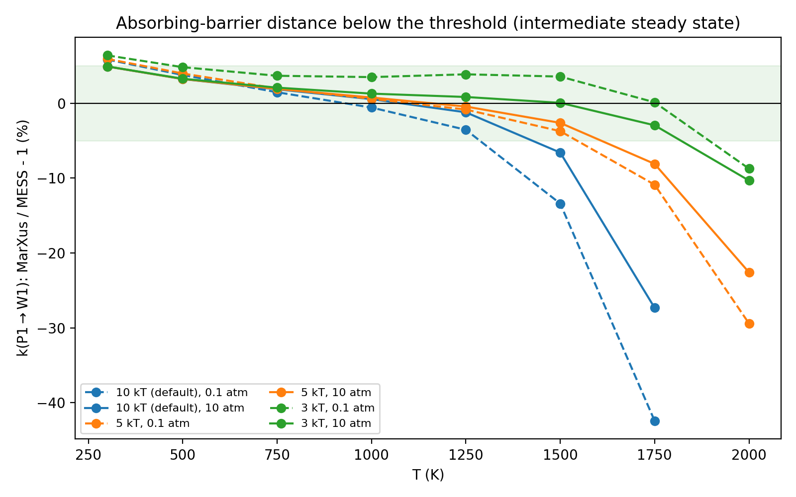

**Runs.** `run_marxus.sh` also runs the full deck with the barrier 5 and 3 kT below the threshold (`marxus_output/c2h3_tight_absorbing_barrier_{5,3}kT.*`). All 40 conditions are in `barrier_distance_sensitivity.csv`. The 1 atm rows (MarXus k(P1→W1) relative to MESS):

| T (K) | MESS k(P1→W1) | 10 kT (default) | 5 kT | 3 kT |
|---|---|---|---|---|
| 300 | 2.1202e-13 | +4.7% | +4.7% | +4.8% |
| 500 | 1.7523e-12 | +2.8% | +2.9% | +3.1% |
| 750 | 3.0644e-12 | +1.7% | +1.9% | +2.5% |
| 1000 | 2.5737e-12 | +0.8% | +1.4% | +2.8% |
| 1250 | 1.6573e-12 | −0.9% | +0.7% | +3.5% |
| 1500 | 9.6459e-13 | −6.1% | −1.4% | +3.6% |
| 1750 | 5.5199e-13 | −24.4% | −7.4% | +0.7% |
| 2000 | 3.2672e-13 | not defined | −19.0% | −7.0% |

**Findings:**
- **At low T (≤ 750 K) the result does not depend on the barrier distance.** The steady state lies on a plateau: less than 1% change between 10 and 3 kT. The remaining +2 … +5% is the tunneling-model difference (Section 5.2).
- **At high T a smaller distance recovers MESS.** The barrier then lies above the thermal distribution of the shallow well. With 3 kT the agreement is within 3.6% up to 1750 K. At 1000–1500 K, 3 kT overshoots slightly (+2.8 … +3.6%).
- **At 2000 K** (well depth 9.8 kT) even 3 kT remains 7.0% low. The methods without a barrier apply there.

## 6. Still open

- **Final steady state of deep wells without a sink at low T** (double precision): postponed.
- **CSE species merging** at poor separation (Georgievskii et al. 2013, Sec. IV, as in MESS): planned, `../../reports/cse_species_merging.md`.

## 7. Code changes made for this validation (MarXus, uncommitted; 2026-10-05)

- **Input reader.**
  - Reads `Atom` fragments.
  - Accepts `GroundEnergy` in any unit.
  - Bug fix: block keywords are matched exactly. `WellCutoff 10` had been read as a Well block named "10" that swallowed the whole model.
- **Entrance high-pressure rate coefficient** (`EntranceHighPressureRate`), tested against the ILT input and against canonical TST.
- **Example program** `chemical_activation_from_deck`:
  - optional reactant argument;
  - bimolecular rate coefficients k(R→X) = k∞ Φ_X;
  - every (T, p) solved separately; a condition without a valid steady state is reported as "not available";
  - `--barrier-kt X`;
  - the method is chosen with `--method` or the `MarXus` block of the deck header (main README).
- **Absorbing barrier below the well bottom:** an error instead of a silent clamp.

## 8. History of this directory

- **2026-10-07.** Shock-heating case added (Section 4.9): `input/c2h3_shock_incubation.inp`, `run_shock_incubation.sh`, `shock_incubation_summary.py` and their outputs. No earlier file was changed.

- **2026-10-05.** First comparison: the absorbing-barrier and final steady states. Re-run after the change to isotopic atomic masses (AME2020); rate coefficients changed by at most 1.3·10⁻⁵ relative.
- **2026-10-05, evening.** The thermal eigenpair of the final steady state was studied in a separate directory, `../c2h3_mess_example_olzmann_eigen/`.
- **2026-10-06:**
  - **Four methods.** One run each, in this directory.
  - **One directory**. The eigen-solver runs, the plot section and the results of `../c2h3_mess_example_olzmann_eigen/` were merged into this directory (Section 4.5; outputs `<deck>_olzmann_{lapack,full}.*`, `olzmann_comparison_table.csv`, `plots/olzmann_*.png`), and that directory was removed. Its inputs and MESS reference outputs were byte-identical copies of the ones here.
  - **Olzmann figures restored under their former names** (they had been renamed with an `olzmann_` prefix, and `deviation.png` showed only the absorbing barrier). Regenerated with the current data: `pes_olzmann.png` (the former `pes.png`; `pes.png` here is the PES of the absorbing-barrier picture), `falloff_W1_P1.png`, `eigen_vs_absorbing_barrier.png`, `sum_rule.png`. `deviation.png` is now 2×2: SteadyStateOlzmann against MESS on top, the absorbing barrier at the bottom. The former `deviation.png` and `short_decks_1000K.png` of the eigen directory are `olzmann_deviation.png` and `olzmann_solvers_1000K.png`, because both names are taken here.
  - **Low-energy reservoir state.** It replaces the former reduction factors of the collision kernel (`../../reports/low_energy_reservoir_state.md`). It changed the absorbing-barrier rows at 1250–1750 K and the high-T eigenvalue results (Section 4.7). Rows at 300–1000 K are unchanged to the printed digits.
  - **Method comparison.** `method_comparison.csv` and `plots/method_*.png` (Section 4.6).
  - **Neufeld collision integral.** Re-run 2026-10-06 with the Neufeld collision integral (the new default); all numbers of this README are from that run (`../../reports/collision_integral_neufeld.md`).
